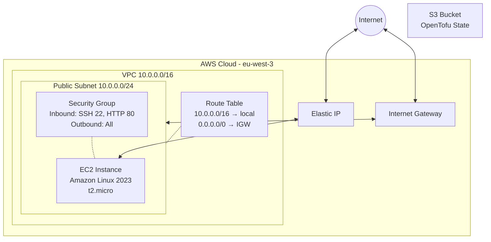
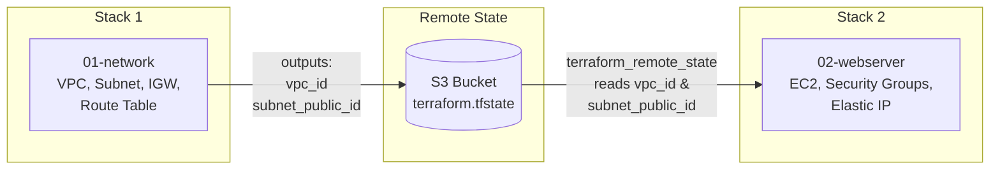
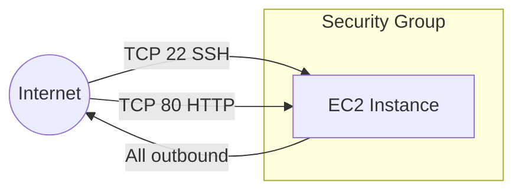

## Purpose

I will show you how to build a simple AWS infrastructure using OpenTofu (an open-source Terraform alternative) for your first steps with Infrastructure as Code.

The example I have chosen is based on [the Getting Started with IPv6 for Amazon VPC](https://docs.aws.amazon.com/vpc/latest/userguide/get-started-ipv6.html). By the end of this tutorial, you will have created an EC2 instance running a web server, fully deployed and managed through code.

The full source code is available on my [GitHub repository](https://github.com/richardpct/aws-terraform-tuto01).

## What you will build

You will learn how to create:

* An S3 bucket for storing OpenTofu state
* A VPC with a public subnet
* An Internet Gateway and a route table
* Security groups defining firewall rules (SSH and HTTP)
* An EC2 instance using an Amazon Linux image
* An Elastic IP for a stable public address
* An SSH key pair for connecting to the instance

## Architecture overview

The following diagram shows the overall infrastructure you will deploy:



## Why split the code into separate stacks?

Rather than putting all Terraform code in a single directory, this project is split into three independent stacks: **bucket**, **network**, and **webserver**. Each stack manages its own state and can be deployed or destroyed independently.

This matters because if you need to change the instance type, you only destroy and rebuild the webserver stack — the network remains untouched. This saves time, reduces risk, and mirrors how real production infrastructure is organized.

The stacks share data through the S3 bucket. The network stack exports its VPC ID and subnet ID to the remote state, and the webserver stack reads them:



## Project structure

```
aws-terraform-tuto01/
├── 00-bucket/          # S3 bucket for OpenTofu state (deployed first)
│   ├── main.tf
│   ├── Makefile
│   ├── providers.tf
│   ├── variables.tf
│   └── versions.tf
├── 01-network/         # VPC, subnet, Internet Gateway, route table
│   ├── backends.tf
│   ├── main.tf
│   ├── Makefile
│   ├── outputs.tf
│   ├── providers.tf
│   ├── variables.tf
│   └── versions.tf
└── 02-webserver/       # EC2 instance, security groups, Elastic IP
    ├── backends.tf
    ├── main.tf
    ├── Makefile
    ├── outputs.tf
    ├── providers.tf
    ├── variables.tf
    └── versions.tf
```

Each directory contains a `Makefile` that wraps the `tofu init`, `tofu apply`, and `tofu destroy` commands, automatically sourcing your secret environment variables.

## Prerequisites

* You must create a regular user in the IAM management console with appropriate permissions — avoid using the root account.
* You must configure your AWS credentials on your local machine (e.g., via `~/.aws/config` and `~/.aws/credentials`) so that OpenTofu can authenticate with the AWS API.
* You must install the latest OpenTofu version (1.11.x or higher).

## Prepare your variables

Create a file at `~/terraform/aws-terraform-tuto01/terraform_vars_secrets` with the following content:

```bash
export TF_VAR_region="eu-west-3"
export TF_VAR_bucket="XXXX-tofu-state"
export TF_VAR_key_network="tuto-01/dev/network/terraform.tfstate"
export TF_VAR_key_webserver="tuto-01/dev/webserver/terraform.tfstate"
export TF_VAR_ssh_public_key="ssh-ed25519 AAAAXXXX"
```

Replace `XXXX-tofu-state` with a globally unique bucket name, and paste your actual SSH public key. The `TF_VAR_` prefix tells OpenTofu to map these environment variables to Terraform variables automatically.

## Step 1 — Create the S3 bucket

OpenTofu needs to store the state of your infrastructure somewhere. You could store it locally, but that means only you can access it. By using an S3 bucket, your coworkers can collaborate on the same infrastructure. This bucket should never be deleted as long as you use OpenTofu with AWS.

#### 00-bucket/main.tf

```hcl
resource "aws_s3_bucket" "tutos" {
  bucket        = var.bucket
  force_destroy = true
}

resource "aws_s3_bucket_ownership_controls" "tutos" {
  bucket = aws_s3_bucket.tutos.id

  rule {
    object_ownership = "BucketOwnerPreferred"
  }
}

resource "aws_s3_bucket_versioning" "tutos" {
  bucket = aws_s3_bucket.tutos.id
  versioning_configuration {
    status = "Enabled"
  }
}
```

This creates an S3 bucket with versioning enabled, which protects against accidental state corruption. The `force_destroy = true` flag allows the bucket to be cleaned up even if it still contains objects. The `BucketOwnerPreferred` ownership control ensures consistent permissions.

#### 00-bucket/variables.tf

```hcl
variable "region" {
  type        = string
  description = "region"
}

variable "bucket" {
  type        = string
  description = "bucket"
}
```

The values are not set here with `default` — instead, they come from the `TF_VAR_` environment variables defined in your secrets file. This avoids committing sensitive data to your Git repository.

#### 00-bucket/versions.tf

```hcl
terraform {
  required_version = ">= 1.11.5"
}
```

This enforces a minimum OpenTofu version to avoid compatibility issues.

#### Deploy the bucket

Initialize and apply:

    $ cd 00-bucket
    $ make init
    $ make apply

This creates a local `terraform.tfstate` file — this is the only stack where state is stored locally, since the bucket doesn't exist yet. From now on, all other stacks will store their state remotely in this bucket.

## Step 2 — Create the network stack

The network stack sets up the foundational AWS networking: a VPC, a public subnet, an Internet Gateway, and a route table that sends all outbound traffic through the gateway.

#### 01-network/backends.tf

```hcl
terraform {
  backend "s3" {
    bucket = var.bucket
    key    = var.key_network
    region = var.region
  }
}
```

This tells OpenTofu to store the network stack's state in the S3 bucket created in Step 1, under the key path `tuto-01/dev/network/terraform.tfstate`.

#### 01-network/main.tf

```hcl
resource "aws_vpc" "my_vpc" {
  cidr_block = var.vpc_cidr_block

  tags = {
    Name = "my_vpc"
  }
}
```

This creates a VPC with the CIDR block `10.0.0.0/16`, giving you 65,536 private IP addresses to work with.

```hcl
resource "aws_internet_gateway" "my_igw" {
  vpc_id = aws_vpc.my_vpc.id

  tags = {
    Name = "my_igw"
  }
}
```

The Internet Gateway is the bridge between your VPC and the public internet. Without it, nothing inside the VPC can reach the outside world.

```hcl
resource "aws_subnet" "public" {
  vpc_id     = aws_vpc.my_vpc.id
  cidr_block = var.subnet_public

  tags = {
    Name = "subnet_public"
  }
}
```

This carves out a `/24` subnet (256 addresses) from the VPC. It will become a "public" subnet once we route its traffic through the Internet Gateway.

```hcl
resource "aws_default_route_table" "route" {
  default_route_table_id = aws_vpc.my_vpc.default_route_table_id

  route {
    cidr_block = "0.0.0.0/0"
    gateway_id = aws_internet_gateway.my_igw.id
  }

  tags = {
    Name = "default route"
  }
}

resource "aws_route_table_association" "public" {
  subnet_id      = aws_subnet.public.id
  route_table_id = aws_default_route_table.route.id
}
```

The default route (`0.0.0.0/0`) sends all non-local traffic to the Internet Gateway. Associating this route table with the subnet is what makes it a public subnet — instances inside it can both reach the internet and be reached from the internet (subject to security group rules).

The resulting route table contains:

| Destination  | Target           |
|------------- |------------------|
| 10.0.0.0/16  | local            |
| 0.0.0.0/0    | Internet Gateway |

#### 01-network/outputs.tf

```hcl
output "vpc_id" {
  value       = aws_vpc.my_vpc.id
  description = "vpc id"
}

output "subnet_public_id" {
  value       = aws_subnet.public.id
  description = "subnet public id"
}
```

These outputs are critical: they export the VPC ID and subnet ID to the remote state in S3, so that the webserver stack can reference them without hardcoding any IDs.

#### Deploy the network

    $ cd ../01-network
    $ make init
    $ make apply

## Step 3 — Create the webserver stack

This stack creates the EC2 instance with all its dependencies: an SSH key pair, security groups for firewall rules, and an Elastic IP for a stable public address.

#### 02-webserver/backends.tf

The webserver stack reads the network stack's outputs from S3 using `terraform_remote_state`:

```hcl
data "terraform_remote_state" "network" {
  backend = "s3"

  config = {
    bucket = var.bucket
    key    = var.key_network
    region = var.region
  }
}
```

This is how stacks communicate: the network stack wrote `vpc_id` and `subnet_public_id` to S3, and the webserver stack reads them back with `data.terraform_remote_state.network.outputs.vpc_id`.

#### 02-webserver/main.tf

**SSH key pair** — uploads your public key to AWS so you can SSH into the instance:

```hcl
resource "aws_key_pair" "deployer" {
  key_name   = "deployer-key"
  public_key = var.ssh_public_key
}
```

**Security group** — a virtual firewall attached to the instance. It is associated with the VPC created by the network stack:

```hcl
resource "aws_security_group" "webserver" {
  name   = "sg_webserver"
  vpc_id = data.terraform_remote_state.network.outputs.vpc_id

  tags = {
    Name = "webserver sg"
  }
}
```

**Firewall rules** — three rules define what traffic is allowed:

```hcl
resource "aws_security_group_rule" "inbound_ssh" {
  type              = "ingress"
  from_port         = 22
  to_port           = 22
  protocol          = "tcp"
  cidr_blocks       = ["0.0.0.0/0"]
  security_group_id = aws_security_group.webserver.id
}

resource "aws_security_group_rule" "inbound_http" {
  type              = "ingress"
  from_port         = 80
  to_port           = 80
  protocol          = "tcp"
  cidr_blocks       = ["0.0.0.0/0"]
  security_group_id = aws_security_group.webserver.id
}

resource "aws_security_group_rule" "outbound_all" {
  type              = "egress"
  from_port         = 0
  to_port           = 0
  protocol          = "-1"
  cidr_blocks       = ["0.0.0.0/0"]
  security_group_id = aws_security_group.webserver.id
}
```

The first rule allows SSH access (port 22) from anywhere. In a production environment, you would restrict this to your own IP address. The second rule allows HTTP traffic (port 80) from anywhere — this is how users will reach your web server. The third rule allows all outbound traffic, so the instance can download packages and updates.

The security group rules can be visualized as:



**EC2 instance** — the virtual machine itself:

```hcl
resource "aws_instance" "web" {
  ami                    = var.image_id
  instance_type          = var.instance_type
  key_name               = aws_key_pair.deployer.key_name
  subnet_id              = data.terraform_remote_state.network.outputs.subnet_public_id
  vpc_security_group_ids = [aws_security_group.webserver.id]

  tags = {
    Name = "web server"
  }
}
```

This launches a `t2.micro` instance (free tier eligible) running Amazon Linux 2023. It is placed in the public subnet and protected by the security group. The SSH key is injected so you can connect to it.

**Elastic IP** — a static public IP address attached to the instance:

```hcl
resource "aws_eip" "web" {
  instance = aws_instance.web.id
  domain   = "vpc"
}
```

Without an Elastic IP, your instance would get a random public IP that changes every time the instance stops and starts. The Elastic IP gives you a stable address.

#### 02-webserver/outputs.tf

```hcl
output "public_ip" {
  description = "public ip"
  value       = aws_eip.web.public_ip
}
```

After deployment, this displays the public IP address you can use to connect to your server.

#### Deploy the webserver

    $ cd ../02-webserver
    $ make init
    $ make apply

The output will display something like:

```
Outputs:

public_ip = "35.180.xx.xx"
```

## Step 4 — Install Nginx

Wait a few seconds for the instance to boot, then connect via SSH using the Elastic IP from the output:

    $ ssh ec2-user@xx.xx.xx.xx

Once connected, install and start Nginx:

    $ sudo su -
    # yum update
    # yum install nginx
    # systemctl start nginx

Now open your web browser and navigate to `http://xx.xx.xx.xx` — you should see the default Nginx welcome page. Congratulations, your web server is live!

## Clean up

When you are done, destroy the infrastructure in reverse order:

    $ cd 02-webserver
    $ make destroy
    $ cd ../01-network
    $ make destroy

You do not need to destroy the S3 bucket — you will reuse it in future tutorials for storing OpenTofu state.

## Summary

Congratulations if you have followed this tutorial to the end! You have learned how to use OpenTofu to deploy a complete AWS infrastructure from scratch — a VPC with networking, an EC2 instance with firewall rules, and a web server accessible from the internet.

More importantly, you have seen how to organize your code into independent stacks that communicate through remote state in S3. This pattern scales well: you can modify or rebuild one layer without touching the others.

In the next tutorial, I will show you how to organize your code even better using Terraform modules for reusability.
