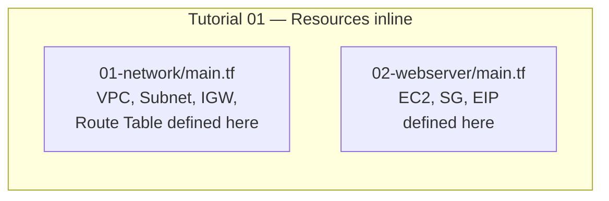
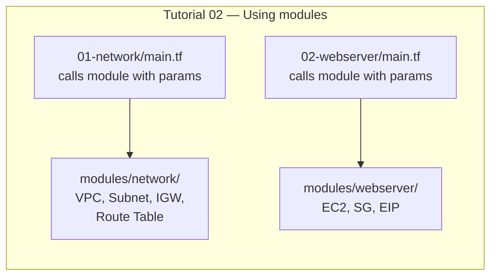
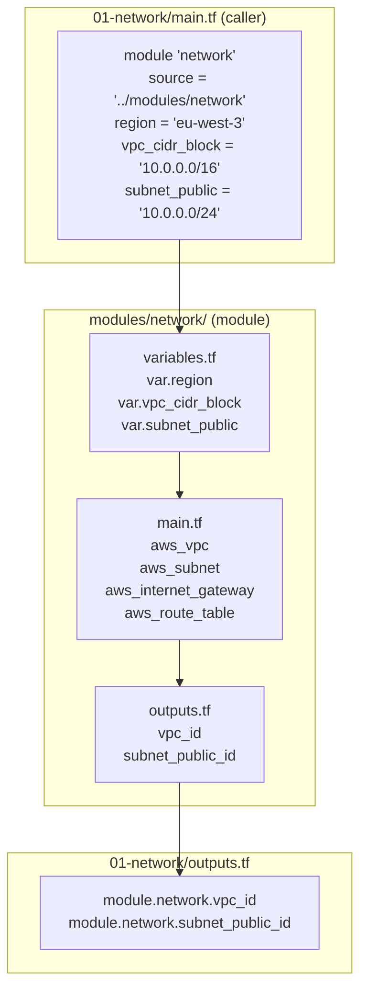

## Purpose

This tutorial builds on [the previous one](https://richardpct.github.io/post/2021/02/20/getting-started-with-aws-and-opentofu/) where we deployed a web server on AWS using OpenTofu. The infrastructure we built works, but all the resource definitions live directly in the stack directories. If we wanted to create a second environment (staging, production), we would have to copy-paste all that code — and as any developer knows, that's a recipe for bugs and drift.

In this tutorial, we refactor the code by introducing **modules**. A module in OpenTofu works like a function in a programming language: it encapsulates a reusable piece of infrastructure and accepts parameters. You write it once, and call it as many times as you need with different values.

As the famous adage in computer science says: **"Don't Repeat Yourself!"**

The full source code is available on my [GitHub repository](https://github.com/richardpct/aws-terraform-tuto02).

## What changes from tutorial 01?

The AWS infrastructure we deploy is exactly the same — a VPC, a public subnet, an EC2 instance running Nginx, behind an Elastic IP. What changes is how the code is organized.

In [tutorial 01](https://richardpct.github.io/post/2021/02/20/getting-started-with-aws-and-opentofu/), the resource definitions lived directly inside the `01-network/main.tf` and `02-webserver/main.tf` files. In this tutorial, those resources are extracted into reusable modules, and the stack files simply call the modules with parameters:





The benefit becomes clear when you need multiple environments: instead of duplicating resource definitions, you create a new caller directory (e.g., `01-network-staging/`) that invokes the same module with different parameters (a different CIDR block, a different instance type, etc.).

## Project structure

```
aws-terraform-tuto02/
├── modules/                  # Reusable module definitions
│   ├── network/              # Network module: VPC, subnet, IGW, routes
│   │   ├── main.tf
│   │   ├── outputs.tf
│   │   ├── providers.tf
│   │   └── variables.tf
│   └── webserver/            # Webserver module: EC2, SG, EIP
│       ├── main.tf
│       ├── outputs.tf
│       ├── providers.tf
│       └── variables.tf
├── 01-network/               # Module caller for the network stack
│   ├── backends.tf
│   ├── main.tf
│   ├── Makefile
│   ├── outputs.tf
│   ├── variables.tf
│   └── versions.tf
└── 02-webserver/             # Module caller for the webserver stack
    ├── backends.tf
    ├── main.tf
    ├── Makefile
    ├── outputs.tf
    ├── variables.tf
    └── versions.tf
```

The key distinction is the separation between **modules** (reusable building blocks in `modules/`) and **callers** (concrete instances in `01-network/` and `02-webserver/` that invoke those modules with specific values).

## How modules work

A module is just a directory containing regular OpenTofu files (`.tf`). It declares variables as its inputs, resources as its logic, and outputs as its return values. The caller references the module via `source` and passes values for each variable.

Here is how the data flows:



The caller passes parameters in, the module creates the resources, and the outputs bubble back up to the caller where they are re-exported to the S3 remote state.

## The network module

**modules/network/variables.tf**

The module declares its inputs — what the caller must provide:

```hcl
variable "region" {
  description = "region"
}

variable "vpc_cidr_block" {
  description = "vpc cidr block"
}

variable "subnet_public" {
  description = "public subnet"
}
```

Notice there are no `default` values here. This is intentional: the module is generic and doesn't assume any particular configuration. The caller decides the region, the CIDR block, and the subnet range.

**modules/network/main.tf**

The resource definitions are identical to what we had in tutorial 01, but now they live inside the module:

```hcl
resource "aws_vpc" "my_vpc" {
  cidr_block = var.vpc_cidr_block

  tags = {
    Name = "my_vpc"
  }
}

resource "aws_internet_gateway" "my_igw" {
  vpc_id = aws_vpc.my_vpc.id

  tags = {
    Name = "my_igw"
  }
}

resource "aws_subnet" "public" {
  vpc_id     = aws_vpc.my_vpc.id
  cidr_block = var.subnet_public

  tags = {
    Name = "subnet_public"
  }
}

resource "aws_default_route_table" "route" {
  default_route_table_id = aws_vpc.my_vpc.default_route_table_id

  route {
    cidr_block = "0.0.0.0/0"
    gateway_id = aws_internet_gateway.my_igw.id
  }

  tags = {
    Name = "default route"
  }
}

resource "aws_route_table_association" "public" {
  subnet_id      = aws_subnet.public.id
  route_table_id = aws_default_route_table.route.id
}
```

Nothing new here — this is the same VPC, subnet, Internet Gateway, and route table from the previous tutorial. The difference is that these resources are now parameterized through variables rather than hardcoded.

**modules/network/outputs.tf**

The module exports the IDs that other stacks will need:

```hcl
output "vpc_id" {
  value = aws_vpc.my_vpc.id
}

output "subnet_public_id" {
  value = aws_subnet.public.id
}
```

## The webserver module

**modules/webserver/variables.tf**

```hcl
variable "region" {
  description = "region"
}

variable "network_remote_state_bucket" {
  description = "bucket"
}

variable "network_remote_state_key" {
  description = "network key"
}

variable "image_id" {
  description = "image id"
}

variable "instance_type" {
  description = "instance type"
}

variable "ssh_public_key" {
  description = "ssh public key"
}
```

The webserver module takes the S3 bucket name and the network state key as inputs, so it can look up the VPC and subnet IDs from the network stack's remote state.

**modules/webserver/main.tf**

```hcl
data "terraform_remote_state" "network" {
  backend = "s3"

  config = {
    bucket = var.network_remote_state_bucket
    key    = var.network_remote_state_key
    region = var.region
  }
}

resource "aws_key_pair" "deployer" {
  key_name   = "deployer-key"
  public_key = var.ssh_public_key
}

resource "aws_security_group" "webserver" {
  name   = "sg_webserver"
  vpc_id = data.terraform_remote_state.network.outputs.vpc_id

  tags = {
    Name = "webserver sg"
  }
}

resource "aws_security_group_rule" "inbound_ssh" {
  type              = "ingress"
  from_port         = 22
  to_port           = 22
  protocol          = "tcp"
  cidr_blocks       = ["0.0.0.0/0"]
  security_group_id = aws_security_group.webserver.id
}

resource "aws_security_group_rule" "inbound_http" {
  type              = "ingress"
  from_port         = 80
  to_port           = 80
  protocol          = "tcp"
  cidr_blocks       = ["0.0.0.0/0"]
  security_group_id = aws_security_group.webserver.id
}

resource "aws_security_group_rule" "outbound_all" {
  type              = "egress"
  from_port         = 0
  to_port           = 0
  protocol          = "-1"
  cidr_blocks       = ["0.0.0.0/0"]
  security_group_id = aws_security_group.webserver.id
}

resource "aws_instance" "web" {
  ami                    = var.image_id
  instance_type          = var.instance_type
  key_name               = aws_key_pair.deployer.key_name
  subnet_id              = data.terraform_remote_state.network.outputs.subnet_public_id
  vpc_security_group_ids = [aws_security_group.webserver.id]

  tags = {
    Name = "web server"
  }
}

resource "aws_eip" "web" {
  instance = aws_instance.web.id
  domain   = "vpc"
}
```

Again, this is the same code from tutorial 01. The key difference is that values like `instance_type`, `image_id`, and `ssh_public_key` are now passed in by the caller instead of being defined with `default` values in the variables file. This makes the module reusable across environments — you could call it with `t2.micro` for dev and `t3.large` for production.

**modules/webserver/outputs.tf**

```hcl
output "public_ip" {
  value = aws_eip.web.public_ip
}
```

## The callers

The caller files are now much simpler — they just invoke the module and pass parameters.

**01-network/main.tf**

```hcl
module "network" {
  source = "../modules/network"

  region         = "eu-west-3"
  vpc_cidr_block = "10.0.0.0/16"
  subnet_public  = "10.0.0.0/24"
}
```

The `source` attribute points to the module directory. Then each variable the module expects is set with a concrete value. This is the entire `main.tf` — compare that to the dozen resources we had directly here in tutorial 01.

**01-network/outputs.tf**

The caller must re-export the module's outputs so they are available in the remote state:

```hcl
output "vpc_id" {
  value = module.network.vpc_id
}

output "subnet_public_id" {
  value = module.network.subnet_public_id
}
```

Note the syntax `module.network.vpc_id` — this references the output named `vpc_id` from the module named `network`.

**02-webserver/main.tf**

```hcl
module "webserver" {
  source = "../modules/webserver"

  region                      = "eu-west-3"
  network_remote_state_bucket = var.bucket
  network_remote_state_key    = var.key_network
  instance_type               = "t2.micro"
  image_id                    = "ami-00235772425cbf8ac" // amazon linux 2023
  ssh_public_key              = var.ssh_public_key
}
```

Some values are hardcoded (region, instance type, AMI), while others come from environment variables via `var.bucket`, `var.key_network`, and `var.ssh_public_key`. This is a common pattern: values that differ between environments are passed through variables, while values that are fixed for this particular deployment are set inline.

**02-webserver/outputs.tf**

```hcl
output "public_ip" {
  value = module.webserver.public_ip
}
```

## Deploy your infrastructure

**Prepare your variables**

Create a file at `~/terraform/aws-terraform-tuto02/terraform_vars_secrets`:

```bash
export TF_VAR_region="eu-west-3"
export TF_VAR_bucket="XXXX-tofu-state"
export TF_VAR_key_network="tuto-02/dev/network/terraform.tfstate"
export TF_VAR_key_webserver="tuto-02/dev/webserver/terraform.tfstate"
export TF_VAR_ssh_public_key="ssh-ed25519 AAAAXXXX"
```

Note: this tutorial reuses the S3 bucket created in tutorial 01. The state keys use `tuto-02/` as a prefix to keep them separate.

**Deploy**

Build the network stack, then the webserver stack:

    $ cd 01-network
    $ make apply
    $ cd ../02-webserver
    $ make apply

**Install Nginx**

Connect to the instance using the Elastic IP displayed in the output:

    $ ssh ec2-user@xx.xx.xx.xx
    $ sudo su -
    # yum update
    # yum install nginx
    # systemctl start nginx

Verify it works:

    $ curl http://xx.xx.xx.xx

You should see the default Nginx welcome page.

**Clean up**

Destroy in reverse order:

    $ cd 02-webserver
    $ make destroy
    $ cd ../01-network
    $ make destroy

## Summary

In this tutorial, we refactored the infrastructure from tutorial 01 by extracting the resource definitions into reusable modules. The infrastructure itself is unchanged, but the code is now organized following the DRY principle:

* **Modules** (`modules/network/` and `modules/webserver/`) contain the reusable resource definitions with parameterized variables.
* **Callers** (`01-network/` and `02-webserver/`) invoke the modules with concrete values.

This separation pays off as your infrastructure grows. Need a staging environment? Create new caller directories that point to the same modules with different parameters — no code duplication needed.

In the next tutorial, I will show you how to leverage this module structure to deploy your infrastructure across multiple environments (dev, staging, prod).
