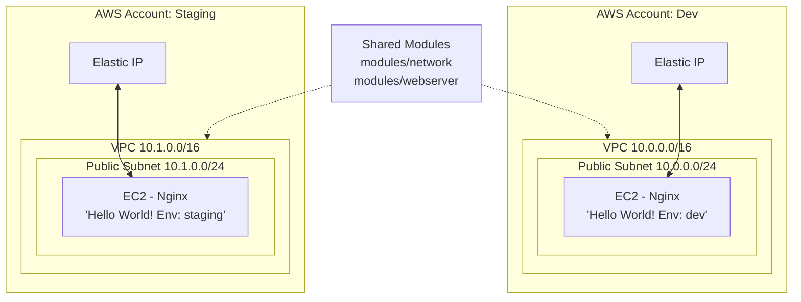
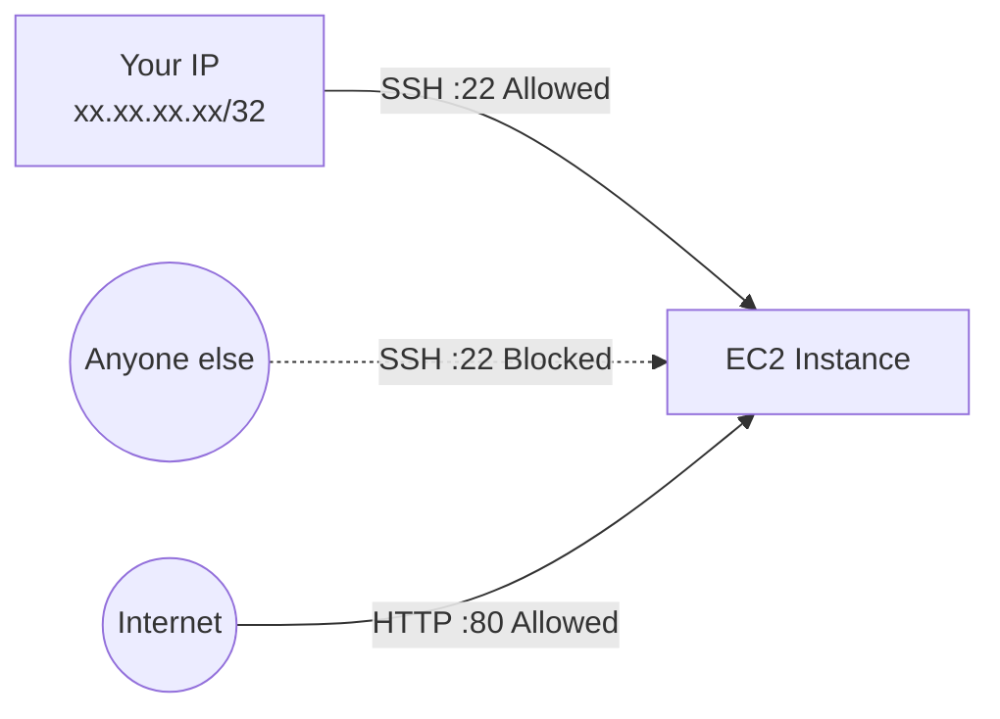

## Purpose

In the [previous tutorial](https://richardpct.github.io/post/2024/03/04/aws-with-opentofu-refactoring-with-modules/), we refactored our infrastructure code into reusable modules. In this tutorial, we put those modules to real use by deploying the same infrastructure across **multiple environments** — Dev and Staging — each running in its own AWS account with its own network configuration.

Along the way, we introduce four practical improvements over the previous tutorials:

* **Multi-environment deployment** — the same modules are called from separate `envs/dev/` and `envs/staging/` directories with different parameters
* **User-data for automated provisioning** — Nginx is installed automatically when the instance boots, no more manual SSH
* **SSH restricted to your IP** — the security group only allows SSH from your own public IP address, not from the entire internet
* **Dynamic AMI selection** — instead of hardcoding an AMI ID, we use the `aws_ami` data source to always pick the latest Amazon Linux image

The full source code is available on my [GitHub repository](https://github.com/richardpct/aws-terraform-tuto03).

## Architecture overview

Both environments deploy the same architecture — a VPC with a public subnet, an EC2 instance running Nginx behind an Elastic IP — but with separate network ranges and isolated in different AWS accounts:



Both environments are created from the exact same module code. The only differences are the parameters passed by each caller: the AWS profile, the CIDR blocks, the environment name, and the S3 state key paths.

## Project structure

```
aws-terraform-tuto03/
├── modules/                          # Shared, reusable modules
│   ├── network/                      # VPC, subnet, IGW, routes
│   │   ├── main.tf
│   │   ├── outputs.tf
│   │   ├── providers.tf
│   │   └── variables.tf
│   └── webserver/                    # EC2, security groups, EIP
│       ├── main.tf
│       ├── outputs.tf
│       ├── providers.tf
│       ├── user-data.sh              # Nginx install script
│       └── variables.tf
├── envs/
│   ├── dev/                          # Dev environment callers
│   │   ├── 01-network/
│   │   │   ├── backends.tf
│   │   │   ├── main.tf
│   │   │   ├── Makefile
│   │   │   ├── outputs.tf
│   │   │   └── variables.tf
│   │   └── 02-webserver/
│   │       ├── backends.tf
│   │       ├── main.tf
│   │       ├── Makefile
│   │       ├── outputs.tf
│   │       └── variables.tf
│   └── staging/                      # Staging environment callers
│       ├── 01-network/
│       │   └── ...                   # Same structure as dev
│       └── 02-webserver/
│           └── ...
```

Compared to tutorial 02, the key structural change is the `envs/` directory. Each environment gets its own subdirectory containing callers that reference the shared modules. Each environment also has its own Makefile that sources a different secrets file (`terraform_vars_dev_secrets` vs `terraform_vars_staging_secrets`).

## What changed in the modules

The modules are mostly the same as tutorial 02, but with several improvements.

### Environment-aware resource naming

All resources now include the environment name in their tags, so you can easily identify which environment a resource belongs to when looking at the AWS console:

```hcl
resource "aws_vpc" "my_vpc" {
  cidr_block = var.vpc_cidr_block

  tags = {
    Name = "my_vpc-${var.env}"
  }
}
```

The `var.env` variable is passed by the caller and can be `"dev"`, `"staging"`, or any other value. Every resource — VPC, subnet, security group, EC2 instance, Elastic IP — follows this naming pattern.

### AWS profiles for multi-account isolation

The providers now accept an `aws_profile` variable, allowing each environment to target a different AWS account:

```hcl
provider "aws" {
  profile = var.aws_profile
  region  = var.region
}
```

This maps to the named profiles in your `~/.aws/credentials` file. The Dev environment uses the `dev` profile, and Staging uses `staging`.

### Dynamic AMI lookup

Instead of hardcoding an AMI ID (which changes across regions and becomes outdated), the webserver module now dynamically selects the latest Amazon Linux 2023 image:

```hcl
data "aws_ami" "amazonlinux" {
  most_recent = true

  filter {
    name   = "name"
    values = ["al2023-ami-*-kernel-*-x86_64"]
  }

  filter {
    name   = "virtualization-type"
    values = ["hvm"]
  }

  owners = [137112412989] # Amazon's official owner ID
}
```

The `most_recent = true` flag ensures you always get the latest patch version. The owner ID `137112412989` is Amazon's official account, so you're guaranteed to get a legitimate image.

### User-data for automated Nginx installation

In the previous tutorials, we had to SSH into the instance and manually install Nginx. Now a user-data script handles that automatically at boot time.

#### modules/webserver/user-data.sh

```bash
#!/usr/bin/env bash

INDEX_HTML=/usr/share/nginx/html/index.html
exec > >(tee /var/log/user-data.log|logger -t user-data -s 2>/dev/console) 2>&1
sudo yum -y update
sudo yum -y upgrade
sudo yum -y install nginx
cat << EOF > $INDEX_HTML
Hello World!<br />
Environment: ${environment}
EOF
sudo systemctl start nginx
```

The `${environment}` placeholder is replaced by OpenTofu's `templatefile()` function before the script is injected into the instance. The `exec` line redirects all output to both a log file and the system console, which is useful for debugging boot issues.

The EC2 instance now uses a **launch template** instead of being created directly, because launch templates support user-data natively:

```hcl
resource "aws_launch_template" "web" {
  name          = "web"
  image_id      = data.aws_ami.amazonlinux.id
  user_data     = base64encode(templatefile("${path.module}/user-data.sh",
                    { environment = var.env }))
  instance_type = var.instance_type
  key_name      = aws_key_pair.deployer.key_name

  network_interfaces {
    subnet_id                   = data.terraform_remote_state.network.outputs.subnet_public_id
    security_groups             = [aws_security_group.webserver.id]
    associate_public_ip_address = true
  }

  lifecycle {
    create_before_destroy = true
  }
}

resource "aws_instance" "web" {
  launch_template {
    id = aws_launch_template.web.id
  }

  tags = {
    Name = "web_server-${var.env}"
  }
}
```

The `templatefile()` function reads `user-data.sh`, replaces `${environment}` with the value of `var.env` (e.g., `"dev"` or `"staging"`), and the result is base64-encoded as required by AWS. The `create_before_destroy` lifecycle rule ensures a smooth replacement if the launch template changes.

### SSH restricted to your IP

The SSH security group rule now uses a variable instead of allowing `0.0.0.0/0`:

```hcl
resource "aws_security_group_rule" "inbound_ssh" {
  type              = "ingress"
  from_port         = 22
  to_port           = 22
  protocol          = "tcp"
  cidr_blocks       = [var.cidr_allowed_ssh]
  security_group_id = aws_security_group.webserver.id
}
```

The caller passes your public IP as `var.cidr_allowed_ssh`, so only you can SSH into the instance. This is a significant security improvement over the previous tutorials:



## The callers

The caller files are very concise — they just invoke the shared modules with environment-specific parameters.

**envs/dev/01-network/main.tf**

```hcl
module "network" {
  source         = "../../../modules/network"
  aws_profile    = var.aws_profile
  region         = var.region
  env            = "dev"
  vpc_cidr_block = "10.0.0.0/16"
  subnet_public  = "10.0.0.0/24"
}
```

**envs/staging/01-network/main.tf**

```hcl
module "network" {
  source         = "../../../modules/network"
  aws_profile    = var.aws_profile
  region         = var.region
  env            = "staging"
  vpc_cidr_block = "10.1.0.0/16"
  subnet_public  = "10.1.0.0/24"
}
```

Notice the differences: the `env` label changes, and the CIDR blocks use `10.0.x.x` for dev and `10.1.x.x` for staging. Everything else — the VPC, subnet, Internet Gateway, route table — is created identically by the same module code.

**envs/dev/02-webserver/main.tf**

```hcl
module "webserver" {
  source                      = "../../../modules/webserver"
  aws_profile                 = var.aws_profile
  region                      = var.region
  env                         = "dev"
  network_remote_state_bucket = var.bucket
  network_remote_state_key    = var.key_network
  instance_type               = "t2.micro"
  ssh_public_key              = var.ssh_public_key
  cidr_allowed_ssh            = var.my_ip_address
}
```

**envs/staging/02-webserver/main.tf**

```hcl
module "webserver" {
  source                      = "../../../modules/webserver"
  region                      = var.region
  env                         = "staging"
  network_remote_state_bucket = var.bucket
  network_remote_state_key    = var.key_network
  instance_type               = "t2.micro"
  ssh_public_key              = var.ssh_public_key
  cidr_allowed_ssh            = var.my_ip_address
}
```

## Deploy the infrastructure

Both environments can be built independently, even simultaneously.

### Prepare the Dev variables

Create a file at `~/terraform/aws-terraform-tuto03/terraform_vars_dev_secrets`:

```bash
export TF_VAR_aws_profile="dev"
export TF_VAR_region="eu-west-3"
export TF_VAR_bucket="XXXX-tofu-state"
export TF_VAR_key_network="tuto-03/dev/network/terraform.tfstate"
export TF_VAR_key_webserver="tuto-03/dev/webserver/terraform.tfstate"
export TF_VAR_ssh_public_key="ssh-ed25519 AAAAXXXX"
MY_IP=$(curl -s ifconfig.co/)
export TF_VAR_my_ip_address="$MY_IP/32"
```

The last two lines dynamically fetch your current public IP and format it as a CIDR block (`/32` means a single address).

### Build the Dev environment

    $ cd envs/dev/01-network
    $ make apply
    $ cd ../02-webserver
    $ make apply

The output will display the Elastic IP:

```
Apply complete! Resources: 8 added, 0 changed, 0 destroyed.

Outputs:

public_ip = "xx.xx.xx.xx"
```

Test it — no manual Nginx installation needed this time:

    $ curl http://xx.xx.xx.xx

Should return:

```
Hello World!<br />
Environment: dev
```

### Prepare the Staging variables

Create a file at `~/terraform/aws-terraform-tuto03/terraform_vars_staging_secrets`:

```bash
export TF_VAR_aws_profile="staging"
export TF_VAR_region="eu-west-3"
export TF_VAR_bucket="XXXX-tofu-state"
export TF_VAR_key_network="tuto-03/staging/network/terraform.tfstate"
export TF_VAR_key_webserver="tuto-03/staging/webserver/terraform.tfstate"
export TF_VAR_ssh_public_key="ssh-ed25519 AAAAXXXX"
MY_IP=$(curl -s ifconfig.co/)
export TF_VAR_my_ip_address="$MY_IP/32"
```

Note the different `aws_profile` and state key paths with `staging/` prefix.

### Build the Staging environment

    $ cd envs/staging/01-network
    $ make apply
    $ cd ../02-webserver
    $ make apply

Test it:

    $ curl http://xx.xx.xx.xx

Should return:

```
Hello World!<br />
Environment: staging
```

The page content confirms that the `${environment}` variable in the user-data script was correctly templated with the environment name.

## Clean up

Destroy each environment in reverse order.

Dev environment:

    $ cd envs/dev/02-webserver
    $ make destroy
    $ cd ../01-network
    $ make destroy

Staging environment:

    $ cd envs/staging/02-webserver
    $ make destroy
    $ cd ../01-network
    $ make destroy

## Summary

In this tutorial, we leveraged the modules from tutorial 02 to deploy identical infrastructure across two separate environments, each with its own AWS account and network configuration. We also introduced three practical improvements: automated Nginx installation via user-data, SSH access restricted to your IP address, and dynamic AMI selection.

The key takeaway is the power of the module pattern: the resource definitions are written once, and each environment simply calls them with different parameters. Adding a new environment (e.g., production) would only require creating a new `envs/prod/` directory with its own callers and secrets file — zero changes to the module code.

In the next tutorial, I will introduce you to private subnets.
