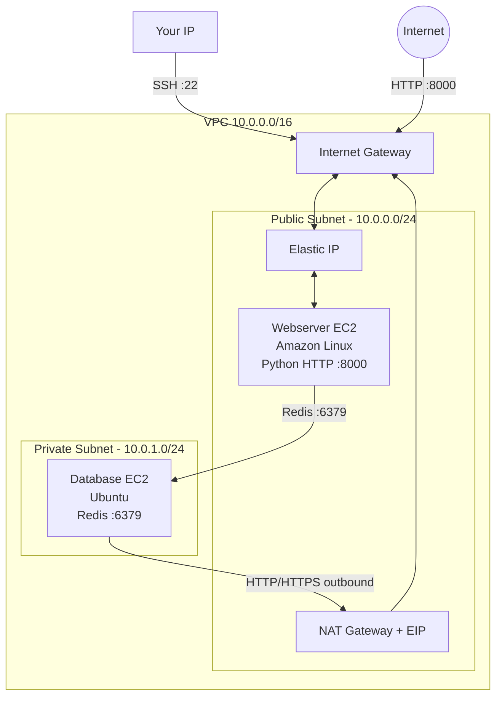
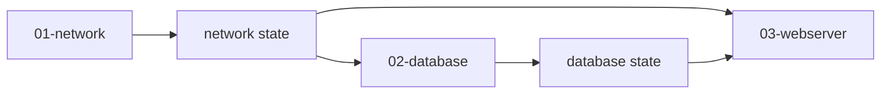
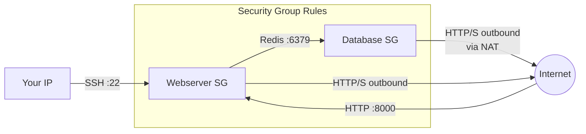

## Purpose

In the [previous tutorial](/post/2024/03/06/aws-with-opentofu-multi-environment-deployments-with-modules/), we deployed our infrastructure across multiple environments using modules. In this tutorial, we introduce a much more realistic network topology: a **public subnet** and a **private subnet** within the same VPC.

The scenario is based on the AWS reference architecture [VPC with Public and Private Subnets (NAT)](https://docs.aws.amazon.com/vpc/latest/userguide/VPC_Scenario2.html?shortFooter=true). You will build:

* A **VPC** with a public subnet and a private subnet
* A **webserver** in the public subnet, running a Python CGI application
* A **Redis database** in the private subnet, counting page requests — only the webserver is allowed to connect to it, enforced by security groups
* A **NAT Gateway** with an Elastic IP in the public subnet, so the database can reach the internet for package updates without being exposed to incoming traffic

Note: for this exercise I intentionally do not use the ElastiCache managed service. Instead, I install Redis on a plain EC2 instance to keep full control and demonstrate the networking concepts.

The full source code is available on my [GitHub repository](https://github.com/richardpct/aws-terraform-tuto04).

## Architecture overview



The key concept is the difference between the two subnets. A **public subnet** has its default route pointing to the Internet Gateway — instances inside can be reached from the internet and can reach it directly. A **private subnet** has its default route pointing to the NAT Gateway — instances can reach the internet (for updates) but cannot be reached from outside. This is why the database is safe in the private subnet: only the webserver can talk to it, via the security group rules.

## How the three stacks communicate

This tutorial introduces a third stack (database), making the state dependency chain longer. Each stack reads the outputs of the previous one from S3:



The webserver stack reads from both the network state (to get the subnet and security group IDs) and the database state (to get the database's private IP address for the Redis connection).

## Project structure

```
aws-terraform-tuto04/
├── modules/
│   ├── network/              # VPC, subnets, IGW, NAT, route tables, security groups
│   │   ├── main.tf
│   │   ├── sg.tf             # All security group rules
│   │   ├── outputs.tf
│   │   ├── providers.tf
│   │   └── variables.tf
│   ├── database/             # Redis EC2 in private subnet
│   │   ├── main.tf
│   │   ├── outputs.tf
│   │   ├── providers.tf
│   │   ├── user-data.sh      # Redis install and configuration
│   │   └── variables.tf
│   └── webserver/            # Python webserver EC2 in public subnet
│       ├── main.tf
│       ├── outputs.tf
│       ├── providers.tf
│       ├── user-data.sh      # Python CGI app with Redis client
│       └── variables.tf
└── envs/
    └── dev/
        ├── 01-network/
        ├── 02-database/
        └── 03-webserver/
```

Notice the new `database` module and the `02-database` stack inserted between network and webserver. The security groups are now defined in a dedicated `sg.tf` file within the network module, since both the webserver and database security groups need to reference each other.

## Network configuration

The network module now creates two subnets with different routing behaviors.

**Public subnet — routes through the Internet Gateway**

```hcl
resource "aws_internet_gateway" "my_igw" {
  vpc_id = aws_vpc.my_vpc.id

  tags = {
    Name = "my_igw-${var.env}"
  }
}

resource "aws_subnet" "public" {
  vpc_id     = aws_vpc.my_vpc.id
  cidr_block = var.subnet_public

  tags = {
    Name = "subnet_public-${var.env}"
  }
}

resource "aws_route_table" "route" {
  vpc_id = aws_vpc.my_vpc.id

  route {
    cidr_block = "0.0.0.0/0"
    gateway_id = aws_internet_gateway.my_igw.id
  }

  tags = {
    Name = "custom_route-${var.env}"
  }
}

resource "aws_route_table_association" "public" {
  subnet_id      = aws_subnet.public.id
  route_table_id = aws_route_table.route.id
}
```

The public subnet's route table sends all non-local traffic (`0.0.0.0/0`) to the Internet Gateway. This is what makes it "public" — instances here can receive incoming connections from the internet.

**NAT Gateway — the bridge for private instances**

```hcl
resource "aws_eip" "nat" {
  domain = "vpc"

  tags = {
    Name = "eip_nat-${var.env}"
  }
}

resource "aws_nat_gateway" "gw" {
  allocation_id = aws_eip.nat.id
  subnet_id     = aws_subnet.public.id

  tags = {
    Name = "nat_gw-${var.env}"
  }
}
```

The NAT Gateway lives in the public subnet (it needs internet access itself) and has its own Elastic IP. Private instances route their outbound traffic through it.

**Private subnet — routes through the NAT Gateway**

```hcl
resource "aws_subnet" "private" {
  vpc_id     = aws_vpc.my_vpc.id
  cidr_block = var.subnet_private

  tags = {
    Name = "subnet_private-${var.env}"
  }
}

resource "aws_default_route_table" "route" {
  default_route_table_id = aws_vpc.my_vpc.default_route_table_id

  route {
    cidr_block = "0.0.0.0/0"
    gateway_id = aws_nat_gateway.gw.id
  }

  tags = {
    Name = "default_route-${var.env}"
  }
}

resource "aws_route_table_association" "private" {
  subnet_id      = aws_subnet.private.id
  route_table_id = aws_default_route_table.route.id
}
```

The private subnet's default route points to the NAT Gateway. This means instances in the private subnet can initiate outbound connections (to download packages, for example) but cannot receive incoming connections from the internet. The route tables for both subnets look like this:

**Public subnet route table:**

| Destination  | Target           |
|------------- |------------------|
| 10.0.0.0/16  | local            |
| 0.0.0.0/0    | Internet Gateway |

**Private subnet route table:**

| Destination  | Target       |
|------------- |--------------|
| 10.0.0.0/16  | local        |
| 0.0.0.0/0    | NAT Gateway  |

## Security group rules

The security groups enforce strict communication rules between the webserver and the database. They are defined in `modules/network/sg.tf` because both groups need cross-references: the database ingress rule references the webserver's security group, and the webserver egress rule references the database's security group.



Here are the key rules:

**Database security group** — only the webserver can connect on the Redis port, and the database can only reach the internet for HTTP/HTTPS (package updates):

```hcl
resource "aws_security_group_rule" "db_from_web_redis" {
  type                     = "ingress"
  from_port                = local.redis_port
  to_port                  = local.redis_port
  protocol                 = "tcp"
  source_security_group_id = aws_security_group.webserver.id
  security_group_id        = aws_security_group.database.id
}
```

Notice that `source_security_group_id` references the webserver's security group, not a CIDR block. This means only instances attached to the webserver security group can connect — even if you know the database's IP, you cannot reach it from anywhere else.

**Webserver security group** — accepts SSH only from your IP, HTTP from everywhere, and can reach the database on the Redis port:

```hcl
resource "aws_security_group_rule" "web_from_me_ssh" {
  type              = "ingress"
  from_port         = local.ssh_port
  to_port           = local.ssh_port
  protocol          = "tcp"
  cidr_blocks       = [var.cidr_allowed_ssh]
  security_group_id = aws_security_group.webserver.id
}

resource "aws_security_group_rule" "web_from_any_http" {
  type              = "ingress"
  from_port         = local.webserver_port
  to_port           = local.webserver_port
  protocol          = "tcp"
  cidr_blocks       = local.anywhere
  security_group_id = aws_security_group.webserver.id
}

resource "aws_security_group_rule" "web_to_db_redis" {
  type                     = "egress"
  from_port                = local.redis_port
  to_port                  = local.redis_port
  protocol                 = "tcp"
  source_security_group_id = aws_security_group.database.id
  security_group_id        = aws_security_group.webserver.id
}
```

## Database configuration

The database module deploys an Ubuntu EC2 instance in the private subnet running Redis. It uses the `aws_ami` data source to automatically pick the latest Ubuntu Noble 24.04 image.

**modules/database/user-data.sh**

```bash
#!/usr/bin/env bash

exec > >(tee /var/log/user-data.log|logger -t user-data -s 2>/dev/console) 2>&1
sudo apt-get update
sudo apt-get -y upgrade
sudo apt-get -y install redis
sudo sed -i -e 's/^\(bind 127.0.0.1.*::1\)/#\1/' /etc/redis/redis.conf
sudo sed -i -e 's/# \(requirepass\) foobared/\1 ${database_pass}/' /etc/redis/redis.conf
sudo systemctl restart redis
```

The script does three things after installing Redis: it comments out the `bind 127.0.0.1` line so Redis listens on all network interfaces (not just localhost), sets the password using the `${database_pass}` variable templated by OpenTofu, and restarts Redis to apply the changes. Even though Redis is listening on all interfaces, the security group ensures only the webserver can actually connect.

The database module exports its **private IP** address, which the webserver will use to connect:

```hcl
output "database_private_ip" {
  value = aws_instance.database.private_ip
}
```

## Webserver configuration

The webserver module deploys an Amazon Linux EC2 instance in the public subnet. It reads remote state from both the network stack (for subnet and security group IDs) and the database stack (for the Redis host IP and SSH key).

**modules/webserver/user-data.sh**

```bash
#!/usr/bin/env bash

exec > >(tee /var/log/user-data.log|logger -t user-data -s 2>/dev/console) 2>&1
sudo yum -y update
sudo yum -y upgrade
sudo yum -y install python3-pip
sudo pip install redis
sudo useradd www -s /sbin/nologin
mkdir -p /var/lib/www/cgi-bin

cat << EOF > /var/lib/www/cgi-bin/hello.py
#!/usr/bin/env python3

import redis

r = redis.Redis(
                host='${database_host}',
                port=6379,
                password='${database_pass}')
r.set('count', 0)
count = r.incr(1)

print("Content-type: text/html")
print("")
print("<html><body>")
print("<p>Hello World!<br />counter: " + str(count) + "<br />env: ${environment}</p>")
print("</body></html>")
EOF

chmod 755 /var/lib/www/cgi-bin/hello.py
cd /var/lib/www
sudo -u www python3 -m http.server 8000 --cgi
```

This script installs the Python Redis client, creates a CGI script at `/var/lib/www/cgi-bin/hello.py`, and starts Python's built-in HTTP server on port 8000 running as a `www` user. The CGI script connects to Redis using the database's private IP (injected via `${database_host}`), increments a counter on each request, and displays the current count along with the environment name.

The three template variables (`${database_host}`, `${database_pass}`, `${environment}`) are injected by OpenTofu's `templatefile()` function in the launch template:

```hcl
resource "aws_launch_template" "web" {
  name      = "web"
  image_id  = data.aws_ami.amazonlinux.id
  user_data = base64encode(templatefile("${path.module}/user-data.sh", {
    environment   = var.env,
    database_host = data.terraform_remote_state.database.outputs.database_private_ip,
    database_pass = var.database_pass
  }))
  instance_type = var.instance_type
  key_name      = data.terraform_remote_state.database.outputs.ssh_key_name

  network_interfaces {
    subnet_id                   = data.terraform_remote_state.network.outputs.subnet_public_id
    security_groups             = [data.terraform_remote_state.network.outputs.sg_webserver_id]
    associate_public_ip_address = true
  }
}
```

## The callers

**envs/dev/01-network/main.tf**

```hcl
module "network" {
  source           = "../../../modules/network"
  aws_profile      = var.aws_profile
  region           = var.region
  env              = "dev"
  vpc_cidr_block   = "10.0.0.0/16"
  subnet_public    = "10.0.0.0/24"
  subnet_private   = "10.0.1.0/24"
  cidr_allowed_ssh = var.my_ip_address
}
```

Note the new `subnet_private` parameter (`10.0.1.0/24`) alongside the public one (`10.0.0.0/24`).

**envs/dev/02-database/main.tf**

```hcl
module "database" {
  source                      = "../../../modules/database"
  aws_profile                 = var.aws_profile
  region                      = var.region
  env                         = "dev"
  network_remote_state_bucket = var.bucket
  network_remote_state_key    = var.key_network
  instance_type               = "t2.micro"
  ssh_public_key              = var.ssh_public_key
  database_pass               = var.database_pass
}
```

**envs/dev/03-webserver/main.tf**

```hcl
module "webserver" {
  source                       = "../../../modules/webserver"
  aws_profile                  = var.aws_profile
  region                       = var.region
  env                          = "dev"
  network_remote_state_bucket  = var.bucket
  network_remote_state_key     = var.key_network
  database_remote_state_bucket = var.bucket
  database_remote_state_key    = var.key_database
  instance_type                = "t2.micro"
  ssh_public_key               = var.ssh_public_key
  database_pass                = var.database_pass
}
```

The webserver caller now references both the network and database remote state keys, since it needs information from both stacks.

## Deploy the infrastructure

**Prepare your variables**

Create a file at `~/terraform/aws-terraform-tuto04/terraform_vars_dev_secrets`:

```bash
export TF_VAR_aws_profile="dev"
export TF_VAR_region="eu-west-3"
export TF_VAR_bucket="XXXX-tofu-state"
export TF_VAR_key_network="tuto-04/dev/network/terraform.tfstate"
export TF_VAR_key_database="tuto-04/dev/database/terraform.tfstate"
export TF_VAR_key_webserver="tuto-04/dev/webserver/terraform.tfstate"
export TF_VAR_ssh_public_key="ssh-ed25519 AAAAXXXX"
export TF_VAR_database_pass="XXXX"
MY_IP=$(curl -s ifconfig.co/)
export TF_VAR_my_ip_address="$MY_IP/32"
```

**Build**

Deploy the three stacks in order:

    $ cd envs/dev/01-network
    $ make apply
    $ cd ../02-database
    $ make apply
    $ cd ../03-webserver
    $ make apply

**Test**

Use the Elastic IP from the webserver output:

    $ curl http://xx.xx.xx.xx:8000/cgi-bin/hello.py

You should see:

```html
<html><body>
<p>Hello World!<br />counter: 1<br />env: dev</p>
</body></html>
```

Run the command again — the counter increments each time, proving that the webserver is successfully communicating with the Redis database in the private subnet.

**Clean up**

Destroy in reverse order:

    $ cd envs/dev/03-webserver
    $ make destroy
    $ cd ../02-database
    $ make destroy
    $ cd ../01-network
    $ make destroy

## Summary

In this tutorial, we introduced the concept of public and private subnets. The webserver lives in the public subnet where it can receive traffic from the internet, while the Redis database is isolated in the private subnet where only the webserver can reach it — enforced both by network routing (NAT Gateway vs Internet Gateway) and by security group rules that reference specific security groups rather than CIDR blocks.

We also added a third stack (database) to the deployment pipeline, demonstrating how the remote state chain scales: the network exports IDs, the database reads them and exports its own outputs, and the webserver reads from both.

In the next tutorial, I will introduce a bastion host for SSH access to instances in the private subnet.
