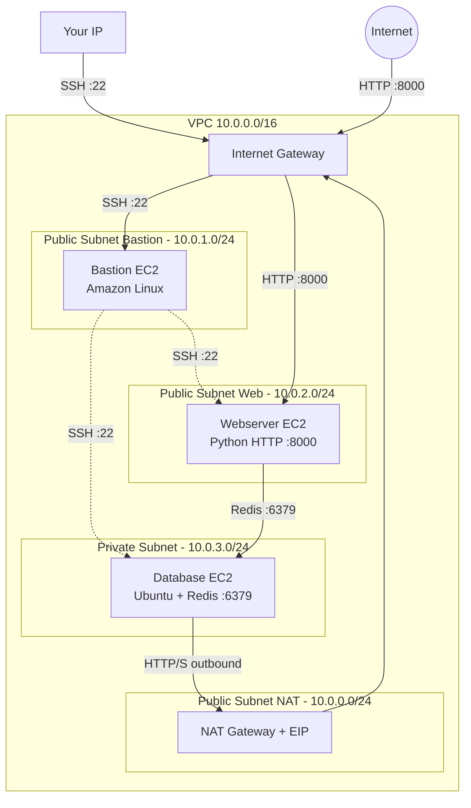
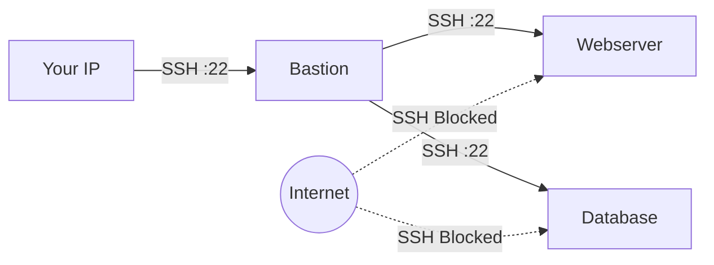
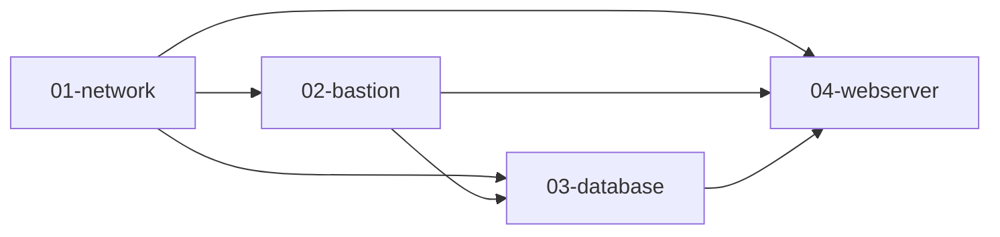

## Purpose

In the [previous tutorial](/post/2026/03/24/aws-with-opentofu-public-and-private-subnets-with-a-database/), we isolated our Redis database in a private subnet. But there was a security gap: the webserver still accepted SSH connections directly from the internet (restricted to your IP, but still exposed). If the webserver is compromised via SSH, an attacker has a direct foothold in your VPC.

In this tutorial, we add a **bastion host** (also called a jump server) to solve this problem. The bastion is the only instance that accepts SSH from the internet. To reach the webserver or the database via SSH, you must first jump through the bastion. This is a standard security pattern in production infrastructure.

Here is what we build:

* A **VPC with 4 subnets** — 3 public subnets (NAT Gateway, bastion, webserver) and 1 private subnet (database)
* A **bastion host** in its own public subnet — the only entry point for SSH from the internet
* A **webserver** in a public subnet — accepts HTTP from the internet but SSH only from the bastion
* A **Redis database** in a private subnet — accepts Redis connections only from the webserver and SSH only from the bastion
* A **NAT Gateway** in its own public subnet — allows the database to reach the internet for package updates

Note: for this exercise I do not use the ElastiCache managed service. Instead, I install Redis on a plain EC2 instance to demonstrate the networking concepts.

The full source code is available on my [GitHub repository](https://github.com/richardpct/aws-terraform-tuto05).

## Architecture overview



Each service lives in its own subnet, which reduces the blast radius of a security issue and makes the firewall rules clearer. In the previous tutorial, the webserver and NAT Gateway shared the same public subnet — now they are separated.

## SSH access flow

The key security improvement is that SSH access now goes through the bastion. Nobody can SSH directly into the webserver or the database from the internet:



In practice, you use SSH's `-J` (jump) option to connect through the bastion transparently:

```bash
# Connect to the database via the bastion
ssh -J ec2-user@<bastion_public_ip> ubuntu@<database_private_ip>

# Connect to the webserver via the bastion
ssh -J ec2-user@<bastion_public_ip> ec2-user@<webserver_private_ip>
```

The `-J` flag tells SSH to first connect to the bastion, then tunnel through it to reach the target. From your perspective, it feels like a direct connection.

## Project structure

```
aws-terraform-tuto05/
├── modules/
│   ├── network/              # VPC, 4 subnets, IGW, NAT, security groups
│   │   ├── main.tf
│   │   ├── sg.tf
│   │   ├── outputs.tf
│   │   ├── providers.tf
│   │   └── variables.tf
│   ├── bastion/              # Bastion EC2 in public subnet
│   │   ├── main.tf
│   │   ├── outputs.tf
│   │   ├── providers.tf
│   │   └── variables.tf
│   ├── database/             # Redis EC2 in private subnet
│   │   ├── main.tf
│   │   ├── outputs.tf
│   │   ├── providers.tf
│   │   ├── user-data.sh
│   │   └── variables.tf
│   └── webserver/            # Python webserver EC2 in public subnet
│       ├── main.tf
│       ├── outputs.tf
│       ├── providers.tf
│       ├── user-data.sh
│       └── variables.tf
└── envs/
    └── dev/
        ├── 01-network/
        ├── 02-bastion/
        ├── 03-database/
        └── 04-webserver/
```

Compared to tutorial 04, the new addition is the `bastion` module and the `02-bastion` stack. The deployment order now has four steps: network, bastion, database, webserver. The bastion stack creates the SSH key pair that is shared with the database and webserver stacks via remote state.

## What changed from tutorial 04

### Four subnets instead of two

The network module now creates four subnets, each dedicated to a specific purpose:

```hcl
module "network" {
  source                = "../../../modules/network"
  aws_profile           = var.aws_profile
  region                = var.region
  env                   = "dev"
  vpc_cidr_block        = "10.0.0.0/16"
  subnet_public_nat     = "10.0.0.0/24"
  subnet_public_bastion = "10.0.1.0/24"
  subnet_public_web     = "10.0.2.0/24"
  subnet_private        = "10.0.3.0/24"
  cidr_allowed_ssh      = var.my_ip_address
}
```

All three public subnets share the same custom route table (default route → Internet Gateway), and the private subnet uses the default route table (default route → NAT Gateway). Isolating each service in its own subnet is a best practice because you can apply different network ACLs per subnet if needed.

### SSH rules now go through the bastion

In tutorial 04, the webserver's SSH rule allowed your IP directly. Now, SSH access to both the webserver and the database is restricted to the bastion's security group:

```hcl
# Only the bastion can SSH into the database
resource "aws_security_group_rule" "db_from_bastion_ssh" {
  type                     = "ingress"
  from_port                = local.ssh_port
  to_port                  = local.ssh_port
  protocol                 = "tcp"
  source_security_group_id = aws_security_group.bastion.id
  security_group_id        = aws_security_group.database.id
}

# Only the bastion can SSH into the webserver
resource "aws_security_group_rule" "web_from_bastion_ssh" {
  type                     = "ingress"
  from_port                = local.ssh_port
  to_port                  = local.ssh_port
  protocol                 = "tcp"
  source_security_group_id = aws_security_group.bastion.id
  security_group_id        = aws_security_group.webserver.id
}
```

And only your IP can SSH into the bastion:

```hcl
resource "aws_security_group_rule" "bastion_from_me_ssh" {
  type              = "ingress"
  from_port         = local.ssh_port
  to_port           = local.ssh_port
  protocol          = "tcp"
  cidr_blocks       = [var.cidr_allowed_ssh]
  security_group_id = aws_security_group.bastion.id
}
```

The bastion also needs an egress rule to SSH out to other instances, plus HTTP/HTTPS egress for system updates:

```hcl
resource "aws_security_group_rule" "bastion_to_any_ssh" {
  type              = "egress"
  from_port         = local.ssh_port
  to_port           = local.ssh_port
  protocol          = "tcp"
  cidr_blocks       = local.anywhere
  security_group_id = aws_security_group.bastion.id
}
```

### The bastion module

The bastion is a minimal EC2 instance — no application is installed on it, just system updates. It exists purely as an SSH gateway:

```hcl
resource "aws_instance" "bastion" {
  ami                    = data.aws_ami.amazonlinux.id
  user_data              = <<-EOF
                           #!/usr/bin/env bash
                           exec > >(tee /var/log/user-data.log|logger -t user-data -s 2>/dev/console) 2>&1
                           sudo yum -y update
                           sudo yum -y upgrade
                           EOF
  instance_type          = var.instance_type
  key_name               = aws_key_pair.deployer.key_name
  subnet_id              = data.terraform_remote_state.network.outputs.subnet_public_bastion_id
  vpc_security_group_ids = [data.terraform_remote_state.network.outputs.sg_bastion_id]

  tags = {
    Name = "bastion-${var.env}"
  }
}

resource "aws_eip" "bastion" {
  instance = aws_instance.bastion.id
  domain   = "vpc"

  tags = {
    Name = "eip_bastion-${var.env}"
  }
}
```

The bastion gets its own Elastic IP so you always connect to the same address. It also creates the SSH key pair, which is exported via outputs and reused by the database and webserver stacks — this way, all instances share the same SSH key.

### Shared SSH key via remote state

The bastion module creates the SSH key pair and exports it:

```hcl
output "ssh_key" {
  value = aws_key_pair.deployer.key_name
}
```

The database and webserver modules read it from the bastion's remote state:

```hcl
key_name = data.terraform_remote_state.bastion.outputs.ssh_key
```

This ensures all instances use the same key, and the key is only created once.

## Stack dependency chain

With four stacks, the remote state dependency chain is now:



The webserver stack reads from three remote states: network (subnet and security group IDs), bastion (SSH key), and database (Redis private IP). This is the most complex dependency graph we have built so far.

## Deploy the infrastructure

### Prepare your variables

Create a file at `~/terraform/aws-terraform-tuto05/terraform_vars_dev_secrets`:

```bash
export TF_VAR_aws_profile="dev"
export TF_VAR_region="eu-west-3"
export TF_VAR_bucket="XXXX-tofu-state"
export TF_VAR_key_network="tuto05/dev/network/terraform.tfstate"
export TF_VAR_key_bastion="tuto05/dev/bastion/terraform.tfstate"
export TF_VAR_key_database="tuto05/dev/database/terraform.tfstate"
export TF_VAR_key_webserver="tuto05/dev/webserver/terraform.tfstate"
export TF_VAR_ssh_public_key="ssh-ed25519 AAAAXXX..."
export TF_VAR_dev_database_pass="XXXX"
MY_IP=$(curl -s ifconfig.co/)
export TF_VAR_my_ip_address="$MY_IP/32"
```

### Build

Deploy the four stacks in order:

    $ cd envs/dev/01-network
    $ make apply
    $ cd ../02-bastion
    $ make apply
    $ cd ../03-database
    $ make apply
    $ cd ../04-webserver
    $ make apply

### Test the webserver

Wait a moment for the user-data scripts to finish, then test the web application:

    $ curl http://<webserver_public_ip>:8000/cgi-bin/hello.py

You should see:

```html
<html><body>
<p>Hello World!<br />counter: 1<br />env: dev</p>
</body></html>
```

Run it again — the counter increments, confirming the webserver is communicating with Redis through the private subnet.

### Test SSH via the bastion

Connect to the database (Ubuntu) through the bastion:

    $ ssh -J ec2-user@<bastion_public_ip> ubuntu@<database_private_ip>

Connect to the webserver (Amazon Linux) through the bastion:

    $ ssh -J ec2-user@<bastion_public_ip> ec2-user@<webserver_private_ip>

Try connecting directly to the webserver without the bastion — it will be refused by the security group.

## Clean up

Destroy in reverse order:

    $ cd envs/dev/04-webserver
    $ make destroy
    $ cd ../03-database
    $ make destroy
    $ cd ../02-bastion
    $ make destroy
    $ cd ../01-network
    $ make destroy

## Summary

In this tutorial, we added a bastion host as the single SSH entry point to our infrastructure. The webserver no longer accepts SSH from the internet — only from the bastion's security group. We also separated each service into its own subnet for better isolation.

The security model is now layered: your IP can SSH into the bastion, the bastion can SSH into everything else, the webserver can talk to Redis, and the database can only reach the internet outbound through the NAT Gateway. Each of these rules is enforced by security groups that reference other security groups, not CIDR blocks — so the rules follow the instances even if their IPs change.

In the next tutorial, you will learn how to use the high availability features provided by AWS.
