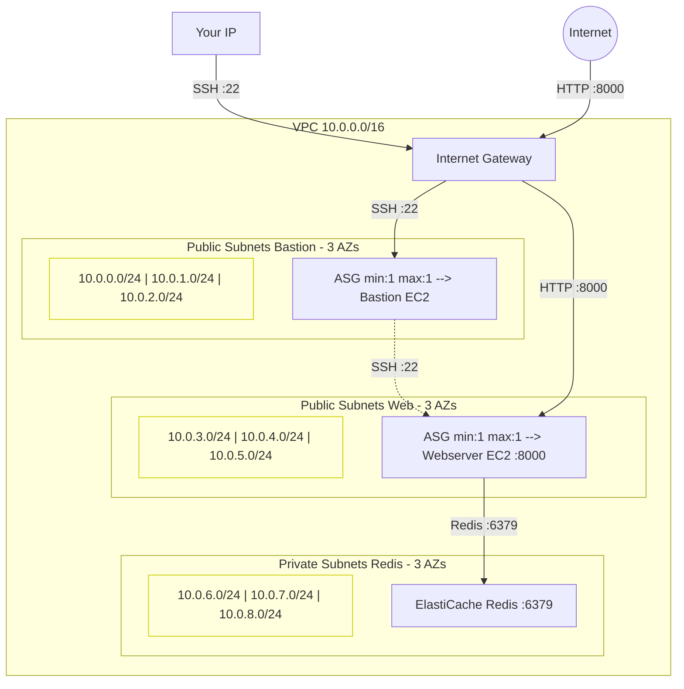
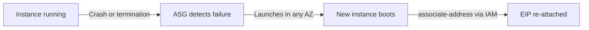

## Purpose

In the [previous tutorial](https://richardpct.github.io/post/2021/03/27/aws-with-opentofu-adding-a-bastion-host-for-secure-ssh-access/), we secured our infrastructure with a bastion host. But there was still a weakness: if the bastion or the webserver crashed, they stayed down until someone manually intervened. In production, that's not acceptable.

In this tutorial, we introduce **Auto Scaling Groups** (ASG) to make the bastion and webserver self-healing. If an instance fails or is terminated for any reason, the ASG automatically launches a replacement — your service experiences only a brief downtime rather than a full outage.

We also make two architectural improvements:

* **ElastiCache replaces the manual Redis EC2** — instead of managing our own Redis installation on an EC2 instance, we use AWS ElastiCache, a managed Redis service. This simplifies the architecture and removes the need for a NAT Gateway (ElastiCache handles its own availability).
* **Multi-AZ subnets** — each service now spans 3 Availability Zones, so if an entire AZ goes down, the ASG can recreate the instance in another AZ.
* **Elastic IP re-association via IAM** — when an ASG replaces an instance, the new instance gets a fresh IP. To keep the same public IP, each instance uses an IAM role to call `aws ec2 associate-address` at boot time, re-attaching the pre-existing Elastic IP to itself.

The full source code is available on my [GitHub repository](https://github.com/richardpct/aws-terraform-tuto06).

## Architecture overview



## What changed from tutorial 05

### From manual Redis to ElastiCache

In the previous tutorials, we installed Redis manually on an EC2 instance in a private subnet, which required a NAT Gateway for package updates. Now we use **AWS ElastiCache**, a fully managed Redis service. This eliminates the need for the NAT Gateway entirely and removes one EC2 instance to manage.

The ElastiCache cluster is deployed across 3 private subnets (one per AZ) and protected by the same database security group — only the webserver can connect on port 6379:

```hcl
resource "aws_elasticache_subnet_group" "redis" {
  name       = "subnet-redis-${var.env}"
  subnet_ids = data.terraform_remote_state.network.outputs.subnet_private_redis_id[*]
}

resource "aws_elasticache_cluster" "redis" {
  cluster_id           = "cluster-redis"
  engine               = "redis"
  node_type            = var.instance_type
  num_cache_nodes      = 1
  parameter_group_name = "default.redis6.x"
  engine_version       = "6.x"
  port                 = 6379
  subnet_group_name    = aws_elasticache_subnet_group.redis.name
  security_group_ids   = [data.terraform_remote_state.network.outputs.sg_database_id]
}
```

Since ElastiCache is a managed service, there is no SSH access, no user-data script, no OS to update — AWS handles all of that. The Redis connection from the webserver uses the ElastiCache endpoint instead of a private IP, and no password is needed (ElastiCache handles authentication differently in its default configuration).

### Multi-AZ subnets with count

Instead of a single subnet per service, each service now has 3 subnets — one per Availability Zone. This is required by the ASG so it can launch replacement instances in any AZ:

```hcl
resource "aws_subnet" "public_bastion" {
  count             = length(var.subnet_public_bastion)
  vpc_id            = aws_vpc.my_vpc.id
  cidr_block        = var.subnet_public_bastion[count.index]
  availability_zone = data.aws_availability_zones.available.names[count.index]

  tags = {
    Name = "subnet_public_bastion-${var.env}"
  }
}
```

The `count` meta-argument creates 3 subnet resources from a single block, each in a different AZ. The same pattern is used for the web subnets. The Redis private subnets are also created as a list, but they are consumed differently — they are passed to an `aws_elasticache_subnet_group` rather than to an Auto Scaling Group. The caller passes all the CIDR blocks as lists:

```hcl
subnet_public_bastion = ["10.0.0.0/24", "10.0.1.0/24", "10.0.2.0/24"]
subnet_public_web     = ["10.0.3.0/24", "10.0.4.0/24", "10.0.5.0/24"]
subnet_private_redis  = ["10.0.6.0/24", "10.0.7.0/24", "10.0.8.0/24"]
```

### Auto Scaling Groups

The bastion and webserver are now managed by ASGs instead of being created as standalone `aws_instance` resources. The ASG ensures exactly one instance is always running:

```hcl
resource "aws_autoscaling_group" "bastion" {
  name                 = "asg_bastion-${var.env}"
  vpc_zone_identifier  = data.terraform_remote_state.network.outputs.subnet_public_bastion_id[*]
  min_size             = 1
  max_size             = 1

  launch_template {
    id = aws_launch_template.bastion.id
  }

  tag {
    key                 = "Name"
    value               = "bastion-${var.env}"
    propagate_at_launch = true
  }
}
```

With `min_size = 1` and `max_size = 1`, the ASG maintains exactly one running instance at all times. The `vpc_zone_identifier` lists all 3 bastion subnets — if the current AZ fails, the replacement instance is launched in one of the other two AZs.

The self-healing process looks like this:



### IAM role for EIP re-association

When an ASG replaces an instance, the new instance gets a random public IP. To keep using the same Elastic IP, each instance needs permission to call `aws ec2 associate-address` to re-attach the EIP to itself at boot time.

This requires an IAM role with the `ec2:AssociateAddress` permission:

```hcl
resource "aws_iam_role" "role" {
  name = "my_role"

  assume_role_policy = <<EOF
{
  "Version": "2012-10-17",
  "Statement": [
    {
      "Action": "sts:AssumeRole",
      "Principal": {
        "Service": "ec2.amazonaws.com"
      },
      "Effect": "Allow"
    }
  ]
}
EOF
}

resource "aws_iam_policy" "policy" {
  name = "my_policy"

  policy = <<EOF
{
  "Version": "2012-10-17",
  "Statement": [
    {
      "Effect": "Allow",
      "Action": [
        "ec2:AssociateAddress"
      ],
      "Resource": "*"
    }
  ]
}
EOF
}

resource "aws_iam_role_policy_attachment" "attach" {
  role       = aws_iam_role.role.name
  policy_arn = aws_iam_policy.policy.arn
}

resource "aws_iam_instance_profile" "profile" {
  name = "my_profile"
  role = aws_iam_role.role.name
}
```

The `assume_role_policy` allows EC2 instances to assume this role. The policy grants only the `ec2:AssociateAddress` action — following the principle of least privilege. The instance profile is attached to the launch template so the EC2 instance inherits the role at boot.

### User-data with EIP association

The bastion's user-data script now performs the EIP re-association after system updates. It uses the EC2 instance metadata service (IMDSv2) to discover its own instance ID, then calls the AWS CLI to attach the Elastic IP:

```bash
#!/usr/bin/env bash

exec > >(tee /var/log/user-data.log|logger -t user-data -s 2>/dev/console) 2>&1
sudo yum -y update
sudo yum -y upgrade
TOKEN=$(curl -X PUT "http://169.254.169.254/latest/api/token" \
  -H "X-aws-ec2-metadata-token-ttl-seconds: 21600")
INSTANCE_ID="$(curl -H "X-aws-ec2-metadata-token: $TOKEN" \
  http://169.254.169.254/latest/meta-data/instance-id)"
aws --region ${region} ec2 associate-address \
  --instance-id $INSTANCE_ID \
  --allocation-id ${eip_bastion_id}
```

The IMDSv2 token-based approach is the secure way to query instance metadata — the `PUT` request obtains a session token, and subsequent `GET` requests use that token. The `${eip_bastion_id}` and `${region}` variables are injected by OpenTofu's `templatefile()` function.

The webserver's user-data follows the same pattern, with the addition of the Python CGI application and Redis client setup.

## Project structure

```
aws-terraform-tuto06/
├── modules/
│   ├── network/              # VPC, multi-AZ subnets, IGW, SGs, IAM, EIPs
│   │   ├── main.tf
│   │   ├── sg.tf
│   │   ├── iam.tf
│   │   ├── outputs.tf
│   │   ├── providers.tf
│   │   └── variables.tf
│   ├── bastion/              # ASG + launch template for bastion
│   │   ├── main.tf
│   │   ├── outputs.tf
│   │   ├── providers.tf
│   │   ├── user-data.sh
│   │   └── variables.tf
│   ├── database/             # ElastiCache Redis cluster
│   │   ├── main.tf
│   │   ├── outputs.tf
│   │   ├── providers.tf
│   │   └── variables.tf
│   └── web/                  # ASG + launch template for webserver
│       ├── main.tf
│       ├── outputs.tf
│       ├── providers.tf
│       ├── user-data.sh
│       └── variables.tf
└── envs/
    └── dev/
        ├── 01-network/
        ├── 02-bastion/
        ├── 03-database/
        └── 04-web/
```

## Deploy the infrastructure

### Prepare your variables

Create a file at `~/terraform/aws-terraform-tuto06/terraform_vars_dev_secrets`:

```bash
export TF_VAR_aws_profile="dev"
export TF_VAR_region="eu-west-3"
export TF_VAR_bucket="XXXX-tofu-state"
export TF_VAR_key_network="tuto-06/dev/network/terraform.tfstate"
export TF_VAR_key_bastion="tuto-06/dev/bastion/terraform.tfstate"
export TF_VAR_key_database="tuto-06/dev/database/terraform.tfstate"
export TF_VAR_key_web="tuto-06/dev/web/terraform.tfstate"
export TF_VAR_ssh_public_key="ssh-ed25519 XXXX"
MY_IP=$(curl -s ifconfig.co/)
export TF_VAR_my_ip_address="$MY_IP/32"
```

### Build

Deploy the four stacks in order:

    $ cd envs/dev/01-network
    $ make apply
    $ cd ../02-bastion
    $ make apply
    $ cd ../03-database
    $ make apply
    $ cd ../04-web
    $ make apply

### Test the webserver

First, retrieve the webserver's Elastic IP:

    $ aws --profile dev ec2 describe-addresses \
        --filters "Name=tag:Name,Values=eip_web-dev" \
        --query 'Addresses[*].PublicIp' \
        --output text

Wait until the EIP is associated with the running instance (this can take a minute while user-data completes):

    $ aws --profile dev ec2 describe-instances \
        --filters "Name=tag-value,Values=web-dev" \
        --query 'Reservations[*].Instances[*].NetworkInterfaces[*].PrivateIpAddresses[*].Association.PublicIp' \
        --output text

Once the output matches the EIP, test the web application:

    $ curl http://<web_eip>:8000/cgi-bin/hello.py

The counter increments with each request, stored in ElastiCache Redis.

## Test the high availability

This is the most interesting part — let's simulate a failure and watch the ASG recover.

Get the instance ID of the running webserver:

    $ aws --profile dev ec2 describe-instances \
        --filters "Name=tag-value,Values=web-dev" "Name=instance-state-name,Values=running" \
        --query "Reservations[*].Instances[*].InstanceId" \
        --output text

Terminate the instance (simulating a crash):

    $ aws --profile dev ec2 terminate-instances --instance-ids <instance_id>

Now watch for the replacement instance to come up:

    $ aws --profile dev ec2 describe-instances \
        --filters "Name=tag-value,Values=web-dev" "Name=instance-state-name,Values=running" \
        --query "Reservations[*].Instances[*].InstanceId" \
        --output text

After a few minutes, a new instance ID appears. Test the web application again using the **same EIP** (it never changed):

    $ curl http://<web_eip>:8000/cgi-bin/hello.py

The application is back, and the counter continues from where it left off — because the data is stored in ElastiCache, not on the instance itself. The EIP is the same because the new instance re-associated it at boot via the IAM role.

## Clean up

Destroy in reverse order:

    $ cd envs/dev/04-web
    $ make destroy
    $ cd ../03-database
    $ make destroy
    $ cd ../02-bastion
    $ make destroy
    $ cd ../01-network
    $ make destroy

## Summary

In this tutorial, we made our infrastructure self-healing using Auto Scaling Groups. If the bastion or webserver crashes, the ASG automatically replaces it, and the new instance re-attaches the same Elastic IP via an IAM role. We also simplified the database layer by switching from a manually managed Redis EC2 to AWS ElastiCache, and spread each service across 3 Availability Zones for resilience against AZ failures.

The downside of this approach is that there is still a brief downtime when an instance is being replaced — the new instance needs time to boot and run its user-data script. In the next tutorial, I will show you how to eliminate this downtime by using a load balancer with multiple webserver instances running simultaneously.
