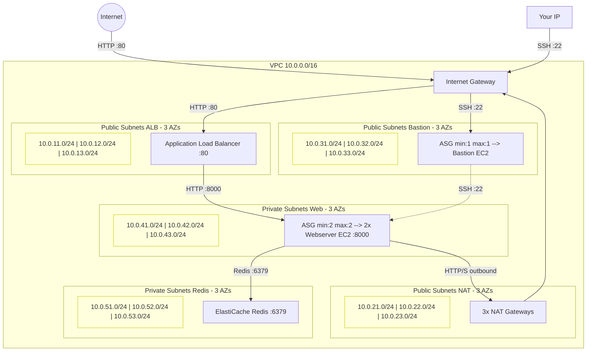
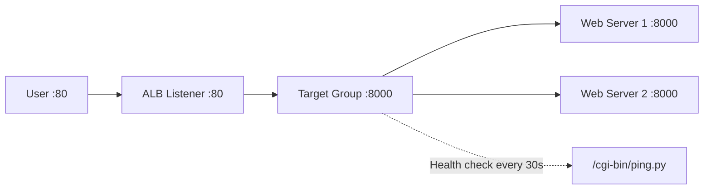

## Purpose

In the [previous tutorial](/post/2026/03/26/aws-with-opentofu-high-availability-with-auto-scaling-groups/), we made our infrastructure self-healing with Auto Scaling Groups. If the webserver crashed, the ASG replaced it — but there was still a brief downtime while the new instance booted. In production, even a few minutes of downtime is unacceptable.

In this tutorial, we solve this by adding an **Application Load Balancer** (ALB) in front of **two webservers**. The ALB distributes requests between them, and if one webserver fails, the other keeps serving traffic immediately — zero downtime. The ASG then replaces the failed instance in the background.

We also make an important architectural change: the **webservers move from the public subnet to the private subnet**. Since users now access the application through the ALB (which lives in the public subnet), the webservers no longer need to be directly exposed to the internet.

The full source code is available on my [GitHub repository](https://github.com/richardpct/aws-terraform-tuto07).

## Architecture overview



## What changed from tutorial 06

### Webservers moved to private subnets

In the previous tutorial, the webservers were in public subnets and each had its own Elastic IP. Now that the ALB handles all inbound traffic, the webservers don't need public IPs anymore. They are moved to private subnets where they are unreachable from the internet — only the ALB can forward requests to them.

This is a significant security improvement. The webservers can still reach the internet for package updates via the NAT Gateway, but no one from outside can connect to them directly.

### One NAT Gateway per Availability Zone

Instead of a single NAT Gateway, we now create one per AZ:

```hcl
resource "aws_nat_gateway" "nat_gw" {
  count         = length(var.subnet_public_nat)
  allocation_id = aws_eip.nat[count.index].id
  subnet_id     = aws_subnet.public_nat[count.index].id

  tags = {
    Name = "nat_gw-${var.env}-${count.index}"
  }
}
```

Each private subnet's route table points to the NAT Gateway in its own AZ. This way, if AZ-A goes down, the private instances in AZ-B and AZ-C are not affected — they use their own NAT Gateways. Each NAT route table is associated with the private web subnet in the same AZ:

```hcl
resource "aws_route_table" "route_nat" {
  count  = length(var.subnet_public_nat)
  vpc_id = aws_vpc.my_vpc.id

  route {
    cidr_block = "0.0.0.0/0"
    gateway_id = aws_nat_gateway.nat_gw[count.index].id
  }
}

resource "aws_route_table_association" "private_web" {
  count          = length(var.subnet_private_web)
  subnet_id      = aws_subnet.private_web[count.index].id
  route_table_id = aws_route_table.route_nat[count.index].id
}
```

The `count.index` ensures AZ-0's web subnet routes through NAT-0, AZ-1's web subnet through NAT-1, and so on.

### Five subnet groups

The network now has 5 groups of subnets, each spanning 3 AZs — for a total of 15 subnets:

| Subnet group | Type | CIDR blocks | Purpose |
|---|---|---|---|
| ALB | Public | 10.0.11-13.0/24 | Load Balancer endpoints |
| NAT | Public | 10.0.21-23.0/24 | NAT Gateways (one per AZ) |
| Bastion | Public | 10.0.31-33.0/24 | SSH jump server |
| Web | Private | 10.0.41-43.0/24 | Webserver instances |
| Redis | Private | 10.0.51-53.0/24 | ElastiCache Redis |

Public subnets route through the Internet Gateway. Private subnets route through the NAT Gateway in their respective AZ.

## The Application Load Balancer

The ALB is the central piece of this tutorial. It is defined in `modules/network/alb.tf` and consists of three resources.

### The load balancer itself

```hcl
resource "aws_lb" "web" {
  name               = "alb-web-${var.env}"
  internal           = false
  load_balancer_type = "application"
  security_groups    = [aws_security_group.alb_web.id]
  subnets            = aws_subnet.public_lb[*].id
}
```

Setting `internal = false` makes it internet-facing. It is deployed across all 3 ALB public subnets and protected by its own security group.

### The target group

```hcl
resource "aws_lb_target_group" "web" {
  port     = local.web_port
  protocol = "HTTP"
  vpc_id   = aws_vpc.my_vpc.id

  health_check {
    healthy_threshold   = 2
    unhealthy_threshold = 2
    timeout             = 3
    interval            = 30
    path                = "/cgi-bin/ping.py"
  }
}
```

The target group defines where the ALB forwards traffic (port 8000) and how it checks if the webservers are healthy. The ALB calls `/cgi-bin/ping.py` on each instance every 30 seconds. If an instance fails 2 consecutive checks (`unhealthy_threshold = 2`), the ALB stops sending it traffic. When the ASG launches a replacement and it passes 2 consecutive checks (`healthy_threshold = 2`), the ALB starts routing to it again.

### The listener

```hcl
resource "aws_lb_listener" "web" {
  load_balancer_arn = aws_lb.web.arn
  port              = 80
  protocol          = "HTTP"

  default_action {
    target_group_arn = aws_lb_target_group.web.arn
    type             = "forward"
  }
}
```

The listener accepts HTTP traffic on port 80 and forwards it to the target group. The flow is:



### ALB security group

The ALB has its own security group that only allows HTTP inbound from anywhere and only forwards to the webserver security group:

```hcl
resource "aws_security_group_rule" "alb_web_from_any_http" {
  type              = "ingress"
  from_port         = local.http_port
  to_port           = local.http_port
  protocol          = "tcp"
  cidr_blocks       = local.anywhere
  security_group_id = aws_security_group.alb_web.id
}

resource "aws_security_group_rule" "alb_web_to_web_http" {
  type                     = "egress"
  from_port                = local.web_port
  to_port                  = local.web_port
  protocol                 = "tcp"
  source_security_group_id = aws_security_group.web.id
  security_group_id        = aws_security_group.alb_web.id
}
```

The webserver security group mirrors this — it accepts HTTP on port 8000 only from the ALB security group:

```hcl
resource "aws_security_group_rule" "web_from_alb_web_http" {
  type                     = "ingress"
  from_port                = local.web_port
  to_port                  = local.web_port
  protocol                 = "tcp"
  source_security_group_id = aws_security_group.alb_web.id
  security_group_id        = aws_security_group.web.id
}
```

## The webserver ASG

The webserver ASG now maintains **2 instances** instead of 1, and is attached to the ALB target group:

```hcl
resource "aws_autoscaling_group" "web" {
  name                = "asg_web-${var.env}"
  vpc_zone_identifier = data.terraform_remote_state.network.outputs.subnet_private_web_id[*]
  target_group_arns   = [data.terraform_remote_state.network.outputs.alb_target_group_web_arn]
  health_check_type   = "ELB"
  min_size            = 2
  max_size            = 2

  launch_template {
    id = aws_launch_template.web.id
  }
}
```

Two important changes compared to tutorial 06:

* **`target_group_arns`** — links the ASG to the ALB target group, so new instances are automatically registered with the load balancer
* **`health_check_type = "ELB"`** — the ASG uses the ALB's health checks (the `/cgi-bin/ping.py` endpoint) instead of basic EC2 status checks. This means if the web application crashes but the instance is still running, the ALB detects it and the ASG replaces the instance

Since the webservers are now in private subnets, the launch template sets `associate_public_ip_address = false` — no public IP is needed.

## The health check endpoint

The user-data script creates a simple `/cgi-bin/ping.py` page that returns "ok":

```python
#!/usr/bin/env python3

print("Content-type: text/html")
print("")
print("<html><body>")
print("<p>ok</p>")
print("</body></html>")
```

This is separate from `hello.py` because the health check should be lightweight — it doesn't need to connect to Redis. The ALB calls this endpoint every 30 seconds on each instance to verify the webserver process is running.

The `hello.py` page now also displays the **instance ID**, so you can see which server is responding:

```python
print("Id: $INSTANCE_ID")
```

When you curl the ALB multiple times, you'll see the instance ID alternating between the two servers — proving the load balancer is distributing requests.

## Project structure

```
aws-terraform-tuto07/
├── modules/
│   ├── network/
│   │   ├── main.tf           # VPC, 15 subnets, IGW, 3 NAT GWs, routes
│   │   ├── sg.tf             # Security groups for bastion, ALB, web, database
│   │   ├── alb.tf            # Application Load Balancer, target group, listener
│   │   ├── iam.tf            # IAM role for EIP association
│   │   ├── outputs.tf
│   │   ├── providers.tf
│   │   └── variables.tf
│   ├── bastion/              # ASG min:1 max:1, EIP re-association
│   ├── database/             # ElastiCache Redis
│   └── web/                  # ASG min:2 max:2, attached to ALB target group
└── envs/
    └── dev/
        ├── 01-network/
        ├── 02-bastion/
        ├── 03-database/
        └── 04-web/
```

The network module now includes `alb.tf` for the load balancer configuration.

## Deploy the infrastructure

### Prepare your variables

Create a file at `~/terraform/aws-terraform-tuto07/terraform_vars_dev_secrets`:

```bash
export TF_VAR_aws_profile="dev"
export TF_VAR_region="eu-west-3"
export TF_VAR_bucket="XXXX-tofu-state"
export TF_VAR_key_network="tuto-07/dev/network/terraform.tfstate"
export TF_VAR_key_bastion="tuto-07/dev/bastion/terraform.tfstate"
export TF_VAR_key_database="tuto-07/dev/database/terraform.tfstate"
export TF_VAR_key_web="tuto-07/dev/web/terraform.tfstate"
export TF_VAR_ssh_public_key="ssh-ed25519 XXXX"
MY_IP=$(curl -s ifconfig.co/)
export TF_VAR_my_ip_address="$MY_IP/32"
```

### Build

Deploy the four stacks in order:

    $ cd envs/dev/01-network
    $ make apply
    $ cd ../02-bastion
    $ make apply
    $ cd ../03-database
    $ make apply
    $ cd ../04-web
    $ make apply

### Test the application

Get the DNS name of the ALB:

    $ aws --profile dev elbv2 describe-load-balancers --names alb-web-dev \
        --query 'LoadBalancers[*].DNSName' \
        --output text

Test the application by issuing several requests:

    $ curl http://<load_balancer_dns>/cgi-bin/hello.py

Each request increments the counter (stored in ElastiCache Redis). You should also notice the instance ID alternating between two values — that's the ALB distributing traffic across both webservers.

## Test the high availability

This is where the ALB shines. Let's kill one webserver and verify there is **zero downtime**.

First, connect to one of the webservers through the bastion and kill the Python process:

    $ ssh -J ec2-user@<bastion_eip> ec2-user@<web_private_ip>
    $ sudo pkill python3

Now keep making requests:

    $ curl http://<load_balancer_dns>/cgi-bin/hello.py

The ALB detects the unhealthy instance after 2 failed health checks (about 60 seconds) and stops routing to it. During this time and after, you still get responses — from the remaining healthy server. You'll notice the instance ID no longer alternates; only the healthy server's ID appears.

After a few minutes, the ASG launches a replacement instance. Once it boots, runs user-data, and passes 2 consecutive health checks, the ALB starts routing to it again. The instance ID will start alternating again, this time with the new instance's ID.

The key difference from tutorial 06: at no point was the service unavailable. One server was always handling requests while the other was being replaced.

## Clean up

Destroy in reverse order:

    $ cd envs/dev/04-web
    $ make destroy
    $ cd ../03-database
    $ make destroy
    $ cd ../02-bastion
    $ make destroy
    $ cd ../01-network
    $ make destroy

## Summary

In this tutorial, we added an Application Load Balancer to distribute traffic across two webservers, achieving zero-downtime failover. When one webserver fails, the ALB routes all traffic to the remaining healthy server while the ASG replaces the failed one in the background.

We also moved the webservers from public to private subnets — since users access the application through the ALB, the webservers no longer need to be directly exposed to the internet. And we deployed one NAT Gateway per Availability Zone to ensure private instances maintain internet access even if an AZ fails.

In the next tutorial, I will show you how to auto-scale your infrastructure when the servers are overloaded — dynamically adding or removing webservers based on CPU utilization.
