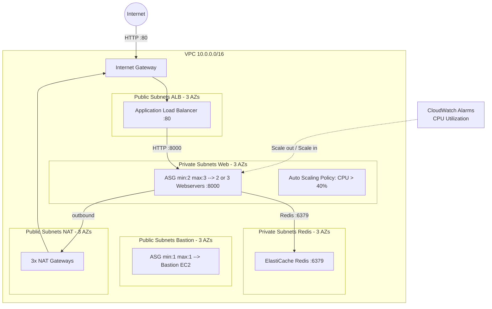

## Purpose

In the [previous tutorial](/post/2024/04/17/aws-with-opentofu-load-balancing-with-alb-for-zero-downtime/), we deployed two webservers behind an Application Load Balancer for zero-downtime failover. The ASG maintained exactly 2 instances at all times — no more, no less. But what happens when traffic spikes and your two servers can't keep up?

In this tutorial, we add an **auto scaling policy** so that the ASG can dynamically scale out from 2 to 3 webservers when the average CPU utilization crosses a threshold, and scale back in when the load drops. This is the difference between a fixed fleet and an elastic one — AWS automatically adjusts capacity to match demand.

The infrastructure is identical to tutorial 07 except for two changes in the web module: `max_size` goes from `2` to `3`, and a new `aws_autoscaling_policy` resource is added. Everything else — the ALB, the bastion, ElastiCache, the 5 subnet groups across 3 AZs — remains the same.

The full source code is available on my [GitHub repository](https://github.com/richardpct/aws-terraform-tuto08).

## Architecture overview



The only visual difference from tutorial 07 is the ASG now shows `min:2 max:3` and the CloudWatch alarm feeds back into the ASG to trigger scaling actions.

## How auto scaling works

The scaling process uses a feedback loop between the ASG, CloudWatch, and the scaling policy:

```mermaid
graph LR
    INSTANCES["2 Web Servers"] -- "Report CPU metrics" --> CW[CloudWatch]
    CW -- "Avg CPU > 40%" --> SCALEOUT[Scale Out Alarm]
    SCALEOUT -- "Launch 1 instance" --> ASG[ASG: now 3 instances]
    ASG -- "Report CPU metrics" --> CW2[CloudWatch]
    CW2 -- "Avg CPU < 40%" --> SCALEIN[Scale In Alarm]
    SCALEIN -- "Terminate 1 instance" --> BACK["ASG: back to 2 instances"]
```



AWS creates two CloudWatch alarms automatically when you use `TargetTrackingScaling`: one to trigger scale-out (when the metric exceeds the target) and one to trigger scale-in (when it drops below). You don't need to define these alarms yourself — the policy handles everything.

## What changed from tutorial 07

The only change is in `modules/web/main.tf`. Two things are different:

### 1. max_size increased to 3

```hcl
resource "aws_autoscaling_group" "web" {
  name                = "asg_web-${var.env}"
  vpc_zone_identifier = data.terraform_remote_state.network.outputs.subnet_private_web_id[*]
  target_group_arns   = [data.terraform_remote_state.network.outputs.alb_target_group_web_arn]
  health_check_type   = "ELB"
  min_size            = 2
  max_size            = 3

  launch_template {
    id = aws_launch_template.web.id
  }

  tag {
    key                 = "Name"
    value               = "web-${var.env}"
    propagate_at_launch = true
  }
}
```

With `min_size = 2`, the ASG always keeps at least 2 instances running — this is your baseline capacity. With `max_size = 3`, the ASG is allowed to launch up to 3 instances when scaling out, but never more. This cap prevents runaway scaling in case of an unexpected load spike.

### 2. The auto scaling policy

```hcl
resource "aws_autoscaling_policy" "web" {
  name                   = "autoscaling_policy_web-${var.env}"
  policy_type            = "TargetTrackingScaling"
  autoscaling_group_name = aws_autoscaling_group.web.name

  target_tracking_configuration {
    predefined_metric_specification {
      predefined_metric_type = "ASGAverageCPUUtilization"
    }

    target_value = 40.0
  }
}
```

This is the core of this tutorial. Let's break it down:

* **`policy_type = "TargetTrackingScaling"`** — this is the simplest and most commonly used scaling policy type. You specify a target value for a metric, and AWS automatically creates the CloudWatch alarms and scaling actions to keep the metric near that target. There are other policy types (`SimpleScaling`, `StepScaling`), but target tracking is recommended for most use cases.

* **`predefined_metric_type = "ASGAverageCPUUtilization"`** — the metric to track. This is the average CPU utilization across all instances in the ASG. AWS provides several predefined metrics; other options include `ALBRequestCountPerTarget` (scale based on request count per instance) and `ASGAverageNetworkIn` (scale based on network traffic).

* **`target_value = 40.0`** — the ASG will try to keep the average CPU utilization at 40%. When it rises above 40%, a third instance is launched. When it drops below 40%, the extra instance is terminated. In production, you would typically set this higher (60-70%), but 40% makes it easier to trigger for testing purposes.

## Deploy the infrastructure

### Prepare your variables

Create a file at `~/terraform/aws-terraform-tuto08/terraform_vars_dev_secrets`:

```bash
export TF_VAR_aws_profile="dev"
export TF_VAR_region="eu-west-3"
export TF_VAR_bucket="XXXX-tofu-state"
export TF_VAR_key_network="tuto-08/dev/network/terraform.tfstate"
export TF_VAR_key_bastion="tuto-08/dev/bastion/terraform.tfstate"
export TF_VAR_key_database="tuto-08/dev/database/terraform.tfstate"
export TF_VAR_key_web="tuto-08/dev/web/terraform.tfstate"
export TF_VAR_ssh_public_key="ssh-ed25519 XXXX"
MY_IP=$(curl -s ifconfig.co/)
export TF_VAR_my_ip_address="$MY_IP/32"
```

### Build

Deploy the four stacks in order:

    $ cd envs/dev/01-network
    $ make apply
    $ cd ../02-bastion
    $ make apply
    $ cd ../03-database
    $ make apply
    $ cd ../04-web
    $ make apply

### Test the application

Get the ALB DNS name:

    $ aws --profile dev elbv2 describe-load-balancers --names alb-web-dev \
        --query 'LoadBalancers[*].DNSName' \
        --output text

Issue several requests:

    $ curl http://<load_balancer_dns>/cgi-bin/hello.py

You should see the counter incrementing and two different instance IDs alternating — confirming the ALB is distributing traffic across both webservers.

## Test the auto scaling

This is the interesting part. We will artificially overload one server's CPU and watch the ASG react by launching a third instance.

### Scale out

Connect to one of the webservers through the bastion and install the `stress` tool:

    $ ssh -J ec2-user@<bastion_eip> ec2-user@<web_private_ip>
    $ sudo yum -y install stress
    $ stress --cpu 1

This saturates one CPU core, pushing that instance's CPU utilization well above 40%. Since the scaling policy uses the **average** across all instances, one overloaded instance is enough to push the average above the threshold (one instance at ~100% and one at ~5% gives an average of ~52%).

Wait a few minutes — CloudWatch needs time to collect data points and trigger the alarm. Then check the running instances:

    $ aws --profile dev ec2 describe-instances \
        --filters "Name=tag-value,Values=web-dev" "Name=instance-state-name,Values=running" \
        --query "Reservations[*].Instances[*].InstanceId" \
        --output text

You should now see **3 instance IDs**. Make some requests to the ALB:

    $ curl http://<load_balancer_dns>/cgi-bin/hello.py

You will now see 3 different instance IDs in the responses — the ALB is distributing traffic across all three webservers.

### Scale in

Stop the stress process by pressing `CTRL-C` in your terminal. The CPU utilization drops back to normal, and the average across all 3 instances falls below 40%.

Wait a few minutes for CloudWatch to detect the change. The ASG will terminate one instance, bringing the fleet back down to 2:

    $ aws --profile dev ec2 describe-instances \
        --filters "Name=tag-value,Values=web-dev" "Name=instance-state-name,Values=running" \
        --query "Reservations[*].Instances[*].InstanceId" \
        --output text

You're back to 2 instances. The scaling is fully automatic — no manual intervention needed.

## Clean up

Destroy in reverse order:

    $ cd envs/dev/04-web
    $ make destroy
    $ cd ../03-database
    $ make destroy
    $ cd ../02-bastion
    $ make destroy
    $ cd ../01-network
    $ make destroy

## Summary

In this tutorial, we added a single resource — `aws_autoscaling_policy` — to make our infrastructure elastic. The ASG now automatically scales from 2 to 3 webservers when the average CPU utilization exceeds 40%, and scales back down when the load drops. AWS handles the CloudWatch alarms and scaling actions automatically through the target tracking policy.

This completes our series on infrastructure fundamentals. Over these 8 tutorials, we have progressively built up from a single EC2 instance to a production-grade architecture with VPC networking, private subnets, a bastion host, an ALB, ElastiCache, Auto Scaling Groups, and dynamic scaling policies. In the next tutorial, I will show you how to apply all of these concepts to deploy a real application: GitLab.
