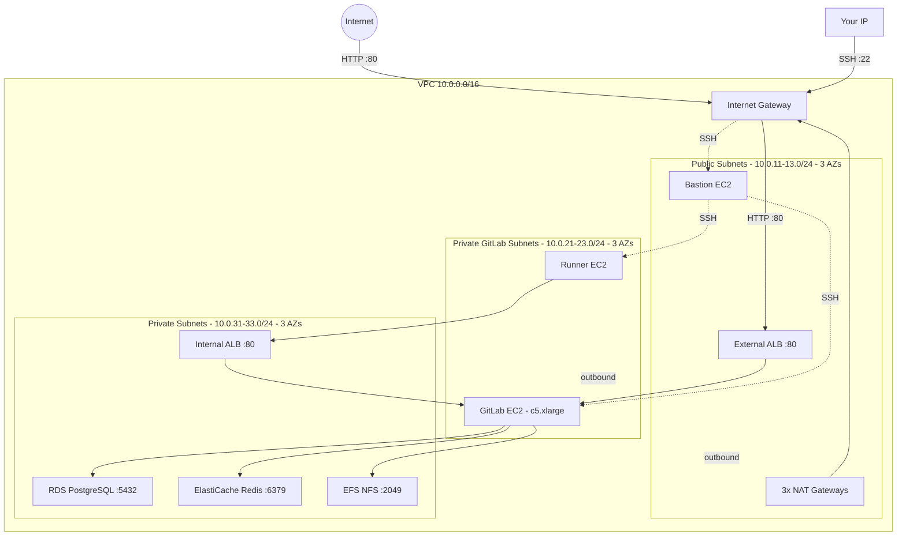
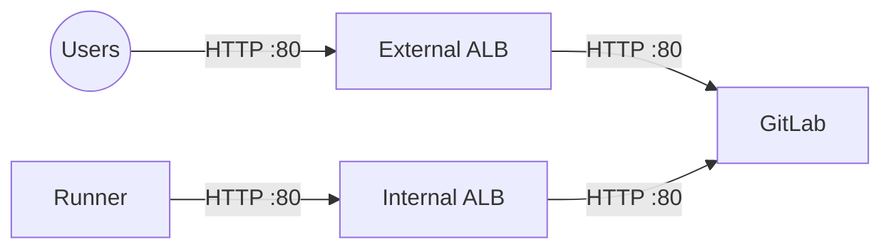
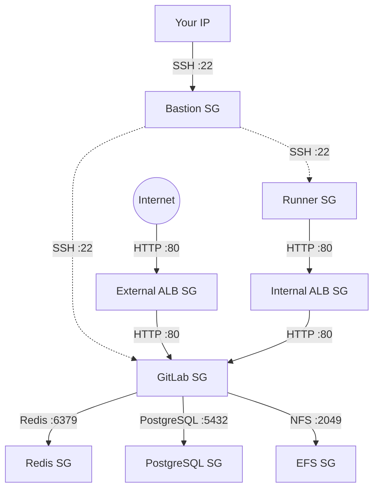

## Purpose

In the [previous tutorials](https://richardpct.github.io/post/2024/04/23/aws-with-opentofu-auto-scaling-based-on-cpu-utilization/), we progressively built up an AWS infrastructure from a single EC2 instance to an auto-scaling fleet behind a load balancer. In this tutorial, we apply everything we have learned to deploy a real-world application: **GitLab**.

GitLab is one of the most widely used Git repository managers in the world, and it includes a built-in CI/CD pipeline engine called **Runners**. For building this infrastructure, I followed the [official GitLab installation guide for AWS](https://docs.gitlab.com/ee/install/aws/), with one simplification: instead of using a separate Gitaly service for Git repository storage, I use a shared NFS filesystem via AWS EFS. This keeps the architecture simpler while still supporting multiple GitLab instances.

The full source code is available on my [GitHub repository](https://github.com/richardpct/aws-terraform-gitlab).

## Architecture overview



## Network design

The network is organized into three subnet groups, each spanning 3 Availability Zones:

| Subnet group | Type | CIDR blocks | Contents | Internet access |
|---|---|---|---|---|
| Public | Public | 10.0.11.0/24, 10.0.12.0/24, 10.0.13.0/24 | Bastion, External ALB, NAT Gateways | Direct via IGW |
| GitLab Private | Private | 10.0.21.0/24, 10.0.22.0/24, 10.0.23.0/24 | GitLab instances, Runners | Outbound via NAT |
| Private | Private | 10.0.31.0/24, 10.0.32.0/24, 10.0.33.0/24 | Internal ALB, PostgreSQL, Redis, EFS | None |

The distinction between the two private subnet groups is important:

* **GitLab Private subnets** route outbound traffic through the NAT Gateway — GitLab and the Runners need internet access to download packages and Docker images.
* **Private subnets** have no route to the NAT Gateway — they host only AWS managed services (RDS, ElastiCache, EFS) and the internal ALB, which don't need internet access.

The VPC has `enable_dns_hostnames = true` set, which is required for EFS mount targets to resolve correctly.

## Two load balancers

A distinctive feature of this architecture is the use of **two ALBs** — one external and one internal:



* **External ALB** — internet-facing, deployed in the public subnets. This is how users access the GitLab web interface. It accepts HTTP on port 80 from anywhere and forwards to the GitLab instance on port 80.
* **Internal ALB** — private, deployed in the private subnets (`internal = true`). This is how Runners communicate with GitLab to fetch jobs and push results. Runners connect to the internal ALB's DNS name, which routes to the same GitLab instance but through a completely private path — no internet traffic involved.

Both ALBs use the same health check: they hit the root path `/` and expect a `302` redirect (GitLab redirects to the login page). The health check is configured with a generous interval of 90 seconds and a high unhealthy threshold of 10, because GitLab takes several minutes to boot.

```hcl
resource "aws_lb" "gitlab_external" {
  name               = "alb-gitlab-external-${var.env}"
  internal           = false
  load_balancer_type = "application"
  security_groups    = [data.terraform_remote_state.network.outputs.sg_alb_gitlab_external_id]
  subnets            = data.terraform_remote_state.network.outputs.subnet_public_id[*]
}

resource "aws_lb" "gitlab_internal" {
  name               = "alb-gitlab-internal-${var.env}"
  internal           = true
  load_balancer_type = "application"
  security_groups    = [data.terraform_remote_state.network.outputs.sg_alb_gitlab_internal_id]
  subnets            = data.terraform_remote_state.network.outputs.subnet_private_id[*]
}
```

The GitLab ASG is registered with **both** target groups, so the single GitLab instance receives traffic from both ALBs:

```hcl
resource "aws_autoscaling_group" "gitlab" {
  target_group_arns = [
    aws_lb_target_group.gitlab_external.arn,
    aws_lb_target_group.gitlab_internal.arn
  ]
  ...
}
```

## Managed services

This architecture uses AWS managed services for data storage:

### RDS PostgreSQL

GitLab uses PostgreSQL as its primary database. We use RDS (Relational Database Service) — a managed PostgreSQL instance:

```hcl
resource "aws_db_instance" "postgres" {
  allocated_storage       = 5
  engine                  = "postgres"
  instance_class          = var.postgres_type
  db_name                 = "gitlabhq_production"
  username                = var.postgres_user
  password                = var.postgres_pass
  skip_final_snapshot     = true
  backup_retention_period = 0
  db_subnet_group_name    = aws_db_subnet_group.postgres.name
  vpc_security_group_ids  = [data.terraform_remote_state.network.outputs.sg_postgres_id]
}
```

The database name `gitlabhq_production` is the default expected by GitLab. The security group only allows connections from the GitLab security group on port 5432.

### ElastiCache Redis

GitLab uses Redis for caching and background job queuing. We use ElastiCache, the same managed Redis service from previous tutorials:

```hcl
resource "aws_elasticache_cluster" "redis" {
  cluster_id           = "cluster-redis"
  engine               = "redis"
  node_type            = var.redis_type
  num_cache_nodes      = 1
  parameter_group_name = "default.redis6.x"
  engine_version       = "6.x"
  port                 = 6379
  subnet_group_name    = aws_elasticache_subnet_group.redis.name
  security_group_ids   = [data.terraform_remote_state.network.outputs.sg_redis_id]
}
```

### EFS (Elastic File System)

EFS provides a shared NFS filesystem that persists across GitLab instance replacements. It stores Git repositories, uploads, shared data, and CI build artifacts:

```hcl
resource "aws_efs_file_system" "gitlab" {
  tags = {
    Name = "gitlab-efs-${var.env}"
  }
}

resource "aws_efs_mount_target" "gitlab" {
  count           = length(var.subnet_private)
  file_system_id  = aws_efs_file_system.gitlab.id
  subnet_id       = aws_subnet.private[count.index].id
  security_groups = [aws_security_group.efs.id]
}
```

Mount targets are created in all 3 private subnets so the GitLab instance can mount the filesystem regardless of which AZ it runs in. The EFS security group only allows NFS traffic (port 2049) from the GitLab security group.

## GitLab configuration

### The launch template

The GitLab instance runs Ubuntu Noble 24.04 on a `c5.xlarge` (4 vCPUs, 8 GB RAM) — GitLab needs significant resources. The root EBS volume is increased to 10 GB because the default 8 GB is not enough to install GitLab:

```hcl
resource "aws_launch_template" "gitlab" {
  name          = "gitlab-${var.env}"
  image_id      = data.aws_ami.ubuntu.id
  instance_type = var.instance_type
  key_name      = data.terraform_remote_state.network.outputs.ssh_key

  block_device_mappings {
    device_name = data.aws_ami.ubuntu.root_device_name

    ebs {
      volume_size           = 10
      volume_type           = "gp2"
      delete_on_termination = true
    }
  }

  network_interfaces {
    security_groups             = [data.terraform_remote_state.network.outputs.sg_gitlab_id]
    associate_public_ip_address = false
  }
}
```

### The user-data script

The user-data script performs the full GitLab installation and configuration at boot time:

```bash
#!/usr/bin/env bash

set -x -e

exec > >(tee /var/log/user-data.log|logger -t user-data -s 2>/dev/console) 2>&1
sudo apt-get update -y
sudo apt-get upgrade -y
sudo apt-get install -y \
  curl openssh-server ca-certificates tzdata perl nfs-common
```

First, it installs the required packages including `nfs-common` for mounting the EFS filesystem.

```bash
mkdir /var/opt/gitlab-nfs
echo '${efs_dns_name}:/ /var/opt/gitlab-nfs nfs4 ...' >> /etc/fstab
mount /var/opt/gitlab-nfs
```

The EFS filesystem is mounted at `/var/opt/gitlab-nfs`. The NFS mount options (`hard,rsize=1048576,wsize=1048576`) are the recommended settings from AWS for maximum throughput.

```bash
curl https://packages.gitlab.com/install/repositories/gitlab/gitlab-ee/script.deb.sh | sudo bash
EXTERNAL_URL="http://${alb_dns_name}" apt-get install gitlab-ee
```

GitLab EE is installed with the `EXTERNAL_URL` set to the external ALB's DNS name. This is the URL users will use to access GitLab.

```bash
cat << EOF >> /etc/gitlab/gitlab.rb
letsencrypt['enable'] = false

postgresql['enable'] = false
gitlab_rails['db_adapter'] = "postgresql"
gitlab_rails['db_encoding'] = "unicode"
gitlab_rails['db_database'] = "gitlabhq_production"
gitlab_rails['db_username'] = "${postgres_user}"
gitlab_rails['db_password'] = "${postgres_pass}"
gitlab_rails['db_host'] = "${postgres_address}"

redis['enable'] = false
gitlab_rails['redis_host'] = "${redis_address}"
gitlab_rails['redis_port'] = 6379

gitaly['configuration'] = {
  storage: [
    {
      name: 'default',
      path: '/var/opt/gitlab-nfs/gitlab-data/git-data/repositories',
    },
  ],
}
gitlab_rails['uploads_directory'] = '/var/opt/gitlab-nfs/gitlab-data/uploads'
gitlab_rails['shared_path'] = '/var/opt/gitlab-nfs/gitlab-data/shared'
gitlab_ci['builds_directory'] = '/var/opt/gitlab-nfs/gitlab-data/builds'
EOF

gitlab-ctl reconfigure
```

The `gitlab.rb` configuration disables the built-in PostgreSQL and Redis (we use the managed services instead), points all data directories to the EFS mount, and disables Let's Encrypt (TLS is not configured in this setup). The `gitlab-ctl reconfigure` command applies the configuration.

```bash
sudo gitlab-rake "gitlab:password:reset[root]" << EOF
${gitlab_pass}
${gitlab_pass}
EOF
```

Finally, the root password is set to the value from the `TF_VAR_gitlab_pass` environment variable.

## GitLab Runners

Runners are the CI/CD execution agents. They poll GitLab for jobs, execute them in Docker containers, and push results back. They run in the GitLab private subnets and communicate with GitLab through the **internal ALB** — never through the internet.

### Runner user-data

```bash
#!/usr/bin/env bash

set -x -e

exec > >(tee /var/log/user-data.log|logger -t user-data -s 2>/dev/console) 2>&1
sudo apt-get update -y
sudo apt-get upgrade -y
sudo apt-get install -y git docker.io
service docker start
cd /tmp
curl -LJO "https://gitlab-runner-downloads.s3.amazonaws.com/latest/deb/gitlab-runner_amd64.deb"
dpkg -i gitlab-runner_amd64.deb
gitlab-runner register \
  --non-interactive \
  --url "http://${alb_internal_dns_name}" \
  --clone-url "http://${alb_internal_dns_name}" \
  --registration-token "${gitlab_token}" \
  --executor "docker" \
  --docker-image "docker:29.4.1" \
  --description "docker-runner" \
  --docker-privileged \
  --docker-volumes "/certs/client"
```

The runner installs Docker and the GitLab Runner package, then registers itself with GitLab using the internal ALB URL. Both `--url` and `--clone-url` point to the internal ALB, so all communication stays within the VPC. The `--executor "docker"` flag means jobs run inside Docker containers, and `--docker-privileged` enables Docker-in-Docker for building container images in CI pipelines.

## Security group rules

This infrastructure has 7 security groups with tightly scoped rules. Here is a summary of the traffic flows:



Every ingress rule uses `source_security_group_id` rather than CIDR blocks, so the rules follow the instances regardless of their IP addresses.

## Project structure

```
aws-terraform-gitlab/
├── modules/
│   ├── network/              # VPC, subnets, IGW, NAT, SGs, IAM, EFS
│   │   ├── main.tf
│   │   ├── sg.tf             # 7 security groups
│   │   ├── efs.tf            # EFS filesystem + mount targets
│   │   ├── iam.tf
│   │   ├── outputs.tf
│   │   ├── providers.tf
│   │   └── variables.tf
│   ├── bastion/              # ASG min:1 max:1, EIP re-association
│   ├── database/             # ElastiCache Redis + RDS PostgreSQL
│   ├── gitlab/               # GitLab EC2, both ALBs, user-data
│   │   ├── main.tf
│   │   ├── alb.tf            # External + Internal ALBs
│   │   ├── user-data.sh
│   │   ├── outputs.tf
│   │   ├── providers.tf
│   │   └── variables.tf
│   └── runner/               # Runner EC2, Docker executor
│       ├── main.tf
│       ├── user-data.sh
│       ├── outputs.tf
│       ├── providers.tf
│       └── variables.tf
└── envs/
    └── dev/
        ├── 01-network/
        ├── 02-bastion/
        ├── 03-database/
        ├── 04-gitlab/
        └── 05-runner/
```

## Deploy the infrastructure

### Prepare your variables

Create a file at `~/terraform/aws-terraform-gitlab/terraform_vars_dev_secrets`:

```bash
export TF_VAR_aws_profile="dev"
export TF_VAR_region="eu-west-3"
export TF_VAR_bucket="XXXX-tofu-state"
export TF_VAR_key_network="gitlab/dev/network/terraform.tfstate"
export TF_VAR_key_bastion="gitlab/dev/bastion/terraform.tfstate"
export TF_VAR_key_database="gitlab/dev/database/terraform.tfstate"
export TF_VAR_key_gitlab="gitlab/dev/gitlab/terraform.tfstate"
export TF_VAR_key_runner="gitlab/dev/runner/terraform.tfstate"
export TF_VAR_postgres_user="gitlab"
export TF_VAR_postgres_pass="XXXX"
export TF_VAR_gitlab_pass="XXXX"
export TF_VAR_ssh_public_key="ssh-ed25519 XXXX"
MY_IP=$(curl -s ifconfig.co/)
export TF_VAR_my_ip_address="$MY_IP/32"
```

Replace the `XXXX` values with your own passwords.

### Build the infrastructure (without the Runner)

Deploy the first four stacks:

    $ cd envs/dev/01-network
    $ make apply
    $ cd ../02-bastion
    $ make apply
    $ cd ../03-database
    $ make apply
    $ cd ../04-gitlab
    $ make apply

GitLab takes several minutes to install. You can monitor the progress by tailing the user-data log via the bastion:

    $ ssh -J ec2-user@<bastion_eip> ubuntu@<gitlab_private_ip> tail -f /var/log/user-data.log

### Access GitLab

Once the installation completes, get the external ALB DNS name:

    $ aws --profile dev elbv2 describe-load-balancers --names alb-gitlab-external-dev \
        --query 'LoadBalancers[*].DNSName' \
        --output text

Open your browser and navigate to `http://<alb_dns_name>`. Log in with the user `root` and the password you set in `TF_VAR_gitlab_pass`.

### Deploy a Runner

Before deploying a Runner, you need a registration token from GitLab. In the GitLab web interface, go to **Admin Area** → **CI/CD** → **Runners**, create a new runner, and copy the registration token. Then set it as an environment variable:

```bash
export TF_VAR_gitlab_token="YOUR_REGISTRATION_TOKEN"
```

Now deploy the runner:

    $ cd ../05-runner
    $ make apply

Wait a minute, then check the Runners page in GitLab — you should see a new runner registered and ready to accept jobs.

## Clean up

Destroy in reverse order:

    $ cd envs/dev/05-runner
    $ make destroy
    $ cd ../04-gitlab
    $ make destroy
    $ cd ../03-database
    $ make destroy
    $ cd ../02-bastion
    $ make destroy
    $ cd ../01-network
    $ make destroy

## Summary

Congratulations if you have followed this tutorial to the end! You have deployed a complete GitLab instance on AWS with all the enterprise patterns we built up across the previous tutorials: VPC with public and private subnets, a bastion host for SSH access, managed databases (RDS PostgreSQL and ElastiCache Redis), shared storage (EFS), Auto Scaling Groups for self-healing, and two Application Load Balancers — one external for users and one internal for CI/CD runners.

This is a real-world architecture that demonstrates the power of Infrastructure as Code. Every component — from the VPC to the GitLab configuration — is defined in OpenTofu and can be destroyed and recreated at will.

In the next tutorial, I will show you how to build a vanilla Kubernetes cluster on AWS using OpenTofu.
