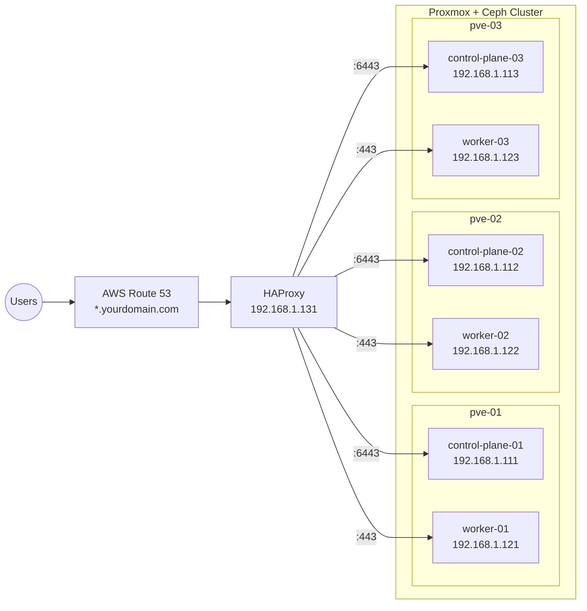

## Purpose

After deploying your Proxmox cluster in [my previous article](https://richardpct.github.io/post/2026/01/05/automating-proxmox-ceph-with-ansible/), this project is intended to show you how to deploy a Kubernetes cluster in high availability on your Proxmox cluster using Terraform/OpenTofu with the Telmate provider. The full source code is available on [GitHub](https://github.com/richardpct/k8s-on-proxmox).

This project fully automates the deployment of a **production-grade, highly available Kubernetes cluster** on a Proxmox VE hypervisor cluster using OpenTofu (Terraform-compatible). Starting from bare Proxmox nodes, a single sequence of `make apply` commands provisions all the infrastructure, bootstraps Kubernetes, and deploys a complete application platform — with no manual SSH or `kubectl` steps required.

The resulting cluster includes:

- **3 control plane nodes** and **3 worker nodes** running Ubuntu 24.04, bootstrapped with `kubeadm`
- **1 HAProxy load balancer** distributing traffic to the API server and to worker nodes
- **Cilium** as the CNI (with kube-proxy replacement, WireGuard encryption, and Hubble observability)
- **Cilium Gateway API** for HTTPS ingress, backed by a Let's Encrypt wildcard certificate
- **Ceph-CSI** for persistent storage via your Proxmox Ceph cluster
- **ArgoCD** for GitOps-based application delivery
- **Vault**, **GitLab**, **Prometheus**, and **Grafana** deployed as applications

DNS is managed through AWS Route 53, and all Terraform state is stored remotely in an S3 bucket.

## Architecture Overview



Each Proxmox node hosts one control plane and one worker, ensuring workloads are distributed across physical hosts.

## Prerequisites

1. **A Proxmox VE cluster** (3 nodes recommended) with Ceph configured for storage.
2. **An AWS account** with Route 53 managing your domain. Your `~/.aws/config` and `~/.aws/credentials` must be configured.
3. **A registered domain name** in AWS Route 53.
4. **OpenTofu** installed on your local machine. Terraform may work with minor adjustments, but the Makefiles call `tofu`.
5. **kubectl** installed locally.
6. **SSH access** to your Proxmox nodes as root (used to upload cloud-init configs and Ubuntu cloud images).

## Project Structure

The project follows a modular Terraform pattern: reusable modules live in `modules/`, and a concrete cluster instance lives in `cluster-01/`. This design lets you create additional clusters (e.g., `cluster-02/`) by simply referencing the same modules with different variables.

```
.
├── modules/                        # Reusable Terraform modules
│   ├── bucket/                     # S3 bucket for Terraform state
│   ├── certificate/                # Let's Encrypt wildcard TLS certificate
│   ├── dns/                        # Route 53 DNS records
│   ├── infra/                      # Proxmox VMs + cloud-init + kubeadm bootstrap
│   │   └── cloud-init/             # Cloud-init templates for each VM role
│   │       ├── kubeadm-master.yaml.tftpl
│   │       ├── kubeadm-worker.yaml.tftpl
│   │       └── loadbalancer.yaml.tftpl
│   └── kubernetes/                 # Helm releases, secrets, Gateway API config
│       ├── helm-values/            # Values files for Cilium, ArgoCD, Vault
│       └── manifests/              # Gateway and HTTPRoute YAML templates
└── cluster-01/                     # Concrete cluster instance
    ├── 01-bucket/                  # Step 1: Create S3 backend
    ├── 02-certificate/             # Step 2: Request TLS certificate
    ├── 03-dns/                     # Step 3: Create DNS entries
    ├── 04-infra/                   # Step 4: Provision VMs and bootstrap K8s
    └── 05-kubernetes/              # Step 5: Deploy platform components
```

Each step has its own `Makefile`, `main.tf`, `variables.tf`, and `backends.tf`. The Makefiles source secrets from `~/terraform/k8s-on-proxmox/tofu_vars_secrets` and wrap `tofu init`/`apply`/`destroy` commands.

## How the Code Works

### Step 1 — S3 Bucket (`modules/bucket/`)

Creates an AWS S3 bucket with versioning enabled to store Terraform remote state. Versioning protects against accidental state corruption. The `force_destroy = true` flag allows the bucket to be destroyed even when it contains objects, which is useful for cleanup.

### Step 2 — TLS Certificate (`modules/certificate/`)

Uses the ACME provider to request a **wildcard certificate** (`*.yourdomain.com`) from Let's Encrypt. The DNS-01 challenge is solved automatically via Route 53 — Terraform creates a temporary TXT record to prove domain ownership, and Let's Encrypt issues the certificate. The resulting private key and full certificate chain (including the issuer) are stored in the Terraform state and later injected into Kubernetes as a TLS secret.

### Step 3 — DNS Records (`modules/dns/`)

Creates A records in Route 53 for each application (ArgoCD, GitLab, Grafana, Prometheus, Vault), all pointing to the load balancer's IP address (`192.168.1.131`). This means `argocd.yourdomain.com`, `gitlab.yourdomain.com`, etc., all resolve to the HAProxy VM, which then routes traffic into the cluster.

### Step 4 — Infrastructure (`modules/infra/`)

This is the most complex module. It performs several operations in sequence:

**a) Ubuntu Cloud Image Provisioning**

The `update_images` resource SSHs into each Proxmox node, downloads the Ubuntu 24.04 cloud image (if not already present or outdated via SHA256 check), and creates a Proxmox VM template from it. This template is then cloned to create the actual VMs.

**b) Cloud-Init Generation and Upload**

Three cloud-init templates are rendered with Terraform's `templatefile()` function and uploaded to each Proxmox node's `/var/lib/vz/snippets/` directory:

- **`kubeadm-master.yaml.tftpl`** — Installs containerd, kubeadm, kubelet, and kubectl. On the primary control plane (`*-01`), it runs `kubeadm init` with `--skip-phases=addon/kube-proxy` (since Cilium replaces kube-proxy) and `--upload-certs` for HA. The `controlPlaneEndpoint` is set to the load balancer IP so all API traffic is routed through HAProxy. It also configures the controller-manager, scheduler, and etcd to expose metrics on `0.0.0.0` for Prometheus scraping.
- **`kubeadm-worker.yaml.tftpl`** — Same containerd and Kubernetes tooling installation, but does not run `kubeadm init` or `join`; the join happens later via SSH.
- **`loadbalancer.yaml.tftpl`** — Installs HAProxy and configures two frontends: one forwarding port `6443` (Kubernetes API) to the three control planes in round-robin, and one forwarding port `443` (HTTPS) to the workers on NodePort `30443` (where the Cilium Gateway listens). It also exposes HAProxy metrics on port `8405` for Prometheus.

**c) VM Creation**

Uses the Telmate Proxmox provider (`proxmox_vm_qemu`) to clone the Ubuntu cloud image template into 7 VMs: 1 load balancer (2 cores, 2 GB RAM, 10 GB disk), 3 control planes (2 cores, 4 GB RAM, 10 GB disk), and 3 workers (4 cores, 6 GB RAM, 30 GB disk). Each VM gets a static IP via cloud-init, and the storage backend switches between `local-lvm` (non-prod) and `mypool` (Ceph, prod) based on the `is_prod` flag.

**d) Cluster Bootstrap**

After all VMs boot and cloud-init finishes (detected by polling for "DONE" in `/var/log/cloud-init-output.log`):

1. The **primary control plane** (`k8s-control-plane-01`) runs `kubeadm init` during cloud-init. Terraform then extracts the `kubeadm join` commands from its logs and saves them as local scripts.
2. The `kubeconfig` is copied from the primary master to `~/.kube/config` on the operator's machine.
3. **Secondary control planes** join via the extracted `kubeadm join --control-plane` command.
4. **Workers** join via the extracted `kubeadm join` command (without `--control-plane`).

### Step 5 — Kubernetes Platform (`modules/kubernetes/`)

Once the cluster is up and `kubectl` works, this module deploys the full platform stack:

**a) TLS Secret**

The wildcard certificate from Step 2 is stored as a `kubernetes.io/tls` secret in `kube-system`, referenced by the Cilium Gateway for HTTPS termination.

**b) Gateway API CRDs**

The Kubernetes Gateway API custom resource definitions (v1.2.0) are applied before Cilium is installed, since Cilium needs them to enable its Gateway API support.

**c) Cilium CNI**

Deployed via Helm with kube-proxy replacement enabled, Gateway API support, Hubble observability (with DNS, TCP, flow, and HTTP metrics), WireGuard-based pod-to-pod encryption, and Prometheus metrics export. The `k8sServiceHost` is set to the load balancer IP so Cilium can reach the API server.

**d) Cilium Gateway**

A `Gateway` resource is created in `kube-system` that listens on NodePort `30443` for HTTPS traffic, using the wildcard TLS certificate. All `HTTPRoute` resources across all namespaces can attach to this single gateway.

**e) Vault**

HashiCorp Vault is deployed in dev mode via Helm into the `vault` namespace. An `HTTPRoute` exposes it at `vault.yourdomain.com`. Terraform waits for Vault to be healthy before proceeding.

**f) Ceph-CSI Setup**

A namespace `ceph-csi` is created, and the Ceph admin secret is stored as a Kubernetes secret. A custom RBAC ClusterRole is created to grant the CephFS provisioner access to `volumeattachments` — this works around a permissions issue in the default Ceph-CSI chart.

**g) Monitoring Setup**

A `monitoring` namespace is created with a secret for the Grafana admin password.

**h) ArgoCD**

Deployed via Helm with 3 replicas for both the server and repo-server. The ArgoCD server is exposed via a Gateway API `HTTPRoute` at `argocd.yourdomain.com`. It is configured in insecure mode (TLS is terminated at the Cilium Gateway, not at ArgoCD).

**i) ArgoCD Applications**

A second Helm release (`argocd-apps`) registers the following applications for GitOps delivery from [github.com/richardpct/argocd-apps](https://github.com/richardpct/argocd-apps):

- **Ceph-CSI** — CephFS CSI driver, configured with your Ceph cluster ID
- **Metrics Server** — cluster metrics for `kubectl top` and HPA
- **GitLab** — self-hosted GitLab instance (exposed via HTTPRoute at `gitlab.yourdomain.com`)
- **kube-prometheus-stack** — Prometheus + Grafana monitoring stack

ArgoCD watches the Git repository and automatically syncs these applications to the cluster.

## Prepare Your Variables

Create a file at `~/terraform/k8s-on-proxmox/tofu_vars_secrets` containing your environment-specific values:

```bash
export TF_VAR_region="eu-west-3"
export TF_VAR_bucket="YOUR_BUCKET"
export TF_VAR_key_certificate="tofu/kubernetes/certificate/tofu.tfstate"
export TF_VAR_key_dns="tofu/kubernetes/dns/tofu.tfstate"
export TF_VAR_key_infra="tofu/kubernetes/infra/tofu.tfstate"
export TF_VAR_key_kubernetes="tofu/kubernetes/kubernetes/tofu.tfstate"
export TF_VAR_my_domain="YOUR_DOMAIN"
export TF_VAR_my_email="YOUR_MAIL"
export TF_VAR_pm_user="terraform-prov@pve"
export TF_VAR_pm_password="YOUR_PVE_PASSWORD"
export TF_VAR_nameserver="YOUR_NAMESERVER"
export TF_VAR_gateway="YOUR_GATEWAY"
export TF_VAR_public_ssh_key="ssh-ed25519 ..."
export TF_VAR_cephfs_secret=$(ssh root@YOUR_PVE_IP ceph auth ls -f json | jq -r '.auth_dump[] | select(.entity=="client.admin") | .key')
export TF_VAR_ceph_cluster_id=$(ssh root@YOUR_PVE_IP ceph -s -f json | jq -r .fsid)
export TF_VAR_vault_token=YOUR_VAULT_TOKEN
export TF_VAR_gitlab_password="YOUR_GITLAB_PASSWORD"
export TF_VAR_grafana_password="YOUR_GRAFANA_PASSWORD"
```

| Variable | Description |
|----------|-------------|
| `YOUR_BUCKET` | A globally unique S3 bucket name for Terraform state |
| `YOUR_DOMAIN` | Your Route 53 registered domain (e.g., `example.com`) |
| `YOUR_MAIL` | Email for Let's Encrypt registration |
| `YOUR_PVE_PASSWORD` | Password for the `terraform-prov@pve` Proxmox user |
| `YOUR_NAMESERVER` | Your local DNS resolver, typically your home router IP |
| `YOUR_GATEWAY` | Your LAN gateway for internet access, typically your home router IP |
| `YOUR_PVE_IP` | IP of any Proxmox node (used to retrieve Ceph credentials via SSH) |
| `YOUR_VAULT_TOKEN` | Root token for Vault |
| `YOUR_GITLAB_PASSWORD` | Root password for the GitLab instance |
| `YOUR_GRAFANA_PASSWORD` | Admin password for Grafana |

## Deploy the Infrastructure

Each step is deployed sequentially from the `cluster-01/` directory. The Makefiles handle `tofu init` and secret sourcing automatically.

**Step 1 — Create the S3 bucket for Terraform state:**

```bash
cd cluster-01/01-bucket
make apply
```

**Step 2 — Request a wildcard TLS certificate via Let's Encrypt DNS challenge:**

```bash
cd ../02-certificate
make apply
```

**Step 3 — Create DNS records pointing your applications to the load balancer:**

```bash
cd ../03-dns
make apply
```

This creates A records for `argocd`, `gitlab`, `grafana`, `prometheus`, and `vault` — all pointing to `192.168.1.131`. You can customize the list in `cluster-01/03-dns/main.tf`.

**Step 4 — Provision VMs and bootstrap the Kubernetes cluster:**

```bash
cd ../04-infra
make apply
```

This is the longest step. It downloads the Ubuntu cloud image to each Proxmox node, creates 7 VMs, waits for cloud-init to finish, initializes the Kubernetes cluster with `kubeadm`, joins the secondary masters and workers, and copies the kubeconfig to your machine.

**Step 5 — Deploy the platform stack on Kubernetes:**

```bash
cd ../05-kubernetes
make apply
```

This installs Cilium, the Gateway API, Vault, ArgoCD, and registers all ArgoCD applications. ArgoCD then takes over and deploys Ceph-CSI, metrics-server, GitLab, and the Prometheus/Grafana monitoring stack from the [argocd-apps repository](https://github.com/richardpct/argocd-apps).

## Clean Up

Destroy everything in reverse order:

```bash
cd cluster-01/05-kubernetes
make destroy

cd ../03-dns
make destroy

cd ../02-certificate
make destroy

cd ../01-bucket
make destroy
```

Note: Step 5's `make destroy` removes all Terraform-managed Kubernetes resources and then also destroys the VMs from Step 4 automatically.

## Customization

To adapt this project to your environment, the main files to edit are:

- **`cluster-01/04-infra/main.tf`** — Change IP addresses, VMID numbers, Proxmox node names, and the Proxmox API URL to match your network and cluster.
- **`cluster-01/03-dns/main.tf`** — Change the load balancer IP and the list of applications that get DNS entries.
- **`modules/infra/variables.tf`** — Adjust VM sizing (CPU cores, memory, disk) in the `locals` block.
- **`modules/kubernetes/helm-values/`** — Tune Helm chart values for Cilium, ArgoCD, or Vault.
