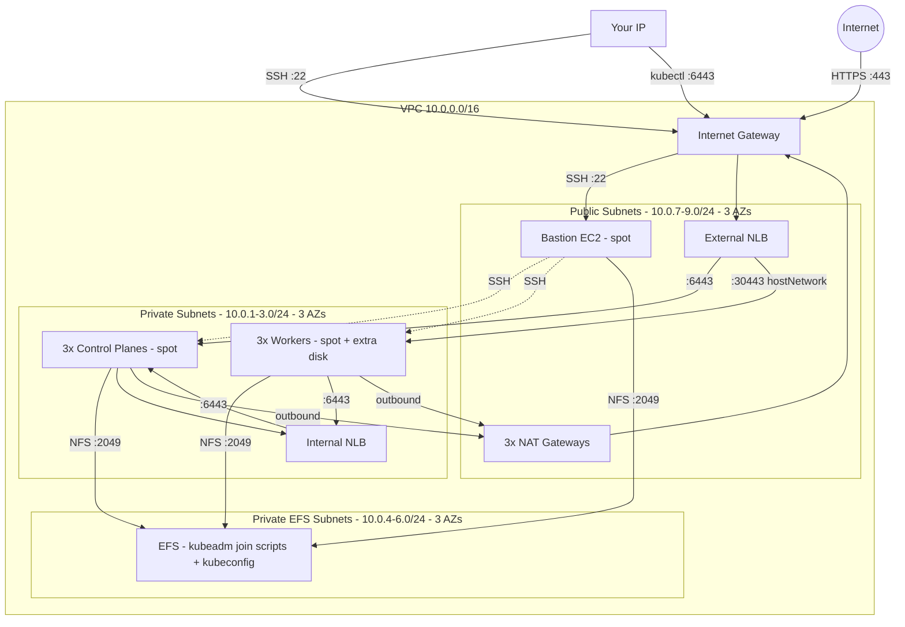
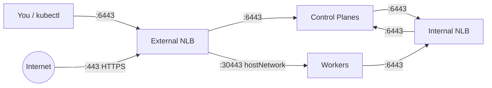
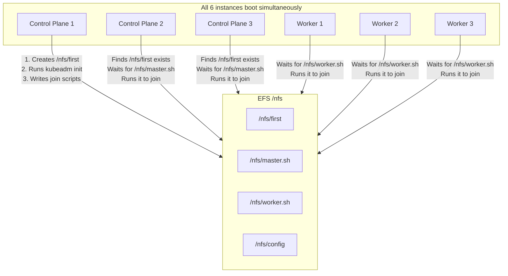

## Purpose

In the [previous tutorials](https://richardpct.github.io/post/2021/06/03/aws-with-opentofu-deploying-a-production-gitlab-instance/), we built increasingly sophisticated AWS infrastructure. In this tutorial, we bring it all together to deploy a **vanilla Kubernetes cluster** using `kubeadm` on AWS.

This is intended as a learning exercise to show you how to build a complex architecture on AWS — in production, you would prefer using EKS (the managed Kubernetes service). But understanding what happens under the hood gives you the skills to troubleshoot and customize any Kubernetes setup.

Here is what we build:

* A **high-availability Kubernetes cluster** with 3 control planes and 3 workers, bootstrapped with `kubeadm`
* **Cilium** as the CNI (replacing kube-proxy), with Gateway API support, Hubble observability, and WireGuard encryption
* **Rook Ceph** as the storage system, providing block, filesystem, and object storage classes
* **Gateway API** for HTTPS ingress, backed by a Let's Encrypt wildcard certificate
* **ArgoCD** for GitOps application delivery, deploying a metrics server
* **Spot instances** instead of regular EC2 instances, to keep costs down
* **Dual architecture support** — the code supports both AMD64 and ARM64, and both Amazon Linux and Ubuntu

The full source code is available on my [GitHub repository](https://github.com/richardpct/aws-vanilla-kubernetes).

## Architecture overview



## Network design

The network has 3 subnet groups across 3 Availability Zones:

| Subnet group | CIDR blocks | Contents | Internet access |
|---|---|---|---|
| Public | 10.0.7.0/24, 10.0.8.0/24, 10.0.9.0/24 | Bastion, External NLB, NAT Gateways | Direct via IGW |
| Private | 10.0.1.0/24, 10.0.2.0/24, 10.0.3.0/24 | Control planes, Workers, Internal NLB | Outbound via NAT |
| Private EFS | 10.0.4.0/24, 10.0.5.0/24, 10.0.6.0/24 | EFS mount targets only | None |

The EFS subnets are isolated from the NAT Gateway because EFS does not need internet access. One NAT Gateway is created per AZ to maintain availability if an AZ goes down.

## Two load balancers

Like in the GitLab tutorial, this architecture uses two load balancers — but here they are **Network Load Balancers** (NLB) instead of Application Load Balancers, because we need to forward TCP traffic directly (Kubernetes API on port 6443 and HTTPS on port 443):



* **External NLB** — internet-facing, with two target groups. It forwards `kubectl` and API requests on port 6443 to the control planes, and forwards HTTPS traffic on port 443 to the workers on port 30443 (where the Cilium Gateway listens in hostNetwork mode — the gateway pod binds directly to the host's network interface, bypassing kube-proxy entirely).
* **Internal NLB** — private, forwards port 6443 to the control planes. This is the `controlPlaneEndpoint` used by `kubeadm` — all Kubernetes internal traffic (kubelet to API, pods to API) goes through this internal NLB, keeping it off the public internet.

## Spot instances for cost savings

All 7 EC2 instances (1 bastion, 3 control planes, 3 workers) use **spot instances** instead of on-demand instances. Spot instances use spare AWS capacity at up to 90% discount, with the caveat that AWS can reclaim them with a 2-minute notice.

Since we have 3 control planes and 3 workers across 3 AZs, the cluster tolerates losing individual instances — the ASG will replace them. The maximum spot prices are configured per instance type:

| Role | Instance type (AMD64) | Max spot price |
|---|---|---|
| Bastion | t3.nano | $0.001/hr |
| Control Plane | t3.small | $0.010/hr |
| Worker | t3.medium | $0.020/hr |

The workers get a 20 GB root disk and an additional 15 GB EBS volume — this extra disk is used by Rook Ceph as an OSD (Object Storage Daemon) for providing persistent storage to the cluster.

## EFS as a coordination mechanism

EFS plays a clever role in this architecture. When 3 control planes and 3 workers boot simultaneously, they need to coordinate: only one control plane should run `kubeadm init`, and the others need to wait for the join commands.

The solution uses EFS as a shared filesystem mounted at `/nfs` on all instances:



The first control plane to boot creates `/nfs/first` as a lock file, runs `kubeadm init`, then writes the join commands to `/nfs/master.sh` and `/nfs/worker.sh`. The other control planes detect that `/nfs/first` already exists, wait for `/nfs/master.sh` to appear, and execute it. The workers wait for `/nfs/worker.sh` and execute it. The kubeconfig is also saved to `/nfs/config` so OpenTofu can later copy it to your local machine.

The `kubeadm init` command uses the internal NLB as the `controlPlaneEndpoint`, so all cluster-internal communication stays private:

```bash
kubeadm init \
  --control-plane-endpoint "${kube_api_internal}:6443" \
  --skip-phases=addon/kube-proxy \
  --apiserver-cert-extra-sans=${kube_api_external},${kube_api_internal} \
  --upload-certs
```

The `--skip-phases=addon/kube-proxy` flag is important — Cilium replaces kube-proxy entirely.

## Kubernetes platform stack

Once the cluster is bootstrapped, the `04-kubernetes` stack deploys the platform components via Helm and kubectl manifests:

1. **TLS Secret** — the Let's Encrypt wildcard certificate is stored as a Kubernetes secret in `kube-system`
2. **Gateway API CRDs** — installed before Cilium, since Cilium needs them for Gateway API support
3. **Cilium** — deployed with kube-proxy replacement, Gateway API, Hubble (DNS, TCP, flow, HTTP metrics), WireGuard encryption, and Prometheus metrics
4. **Cilium Gateway** — a `Gateway` resource listening on port 30443 in hostNetwork mode for HTTPS traffic with the wildcard certificate. Because `gatewayAPI.hostNetwork.enabled` is set in the Cilium Helm values, the gateway pod binds directly to the worker's network interface rather than using a NodePort service.
5. **Rook Ceph Operator** — manages the Ceph cluster lifecycle
6. **Rook Ceph Cluster** — provisions the Ceph storage cluster using the workers' extra EBS volumes, creating three storage classes: `ceph-block`, `ceph-filesystem`, and `ceph-bucket`
7. **ArgoCD** — with 2 server replicas and HTTPRoute for `argocd.yourdomain.com`
8. **ArgoCD Apps** — registers the metrics server for GitOps delivery

## Project structure

```
aws-vanilla-kubernetes/
├── modules/
│   ├── bucket/                   # S3 bucket for remote state
│   ├── certificate/              # Let's Encrypt wildcard certificate
│   ├── network/                  # VPC, subnets, NLBs, security groups, DNS
│   │   ├── main.tf              # VPC, subnets, IGW, NAT, routes
│   │   ├── sg.tf                # 6 security groups
│   │   ├── dns.tf               # Route 53 records
│   │   └── alb.tf               # External + Internal NLBs
│   ├── servers/                  # EC2 instances, EFS, kubeconfig retrieval
│   │   ├── main.tf              # Launch templates, ASGs, spot config
│   │   ├── efs.tf               # EFS filesystem + mount targets
│   │   ├── amazonlinux/         # User-data scripts for Amazon Linux
│   │   └── ubuntu/              # User-data scripts for Ubuntu
│   └── kubernetes/              # Helm releases, Gateway API, TLS
│       ├── main.tf
│       ├── helm-values/         # Cilium, ArgoCD values
│       └── manifests/           # Gateway, HTTPRoute templates
└── cluster-01/                  # Concrete cluster instance
    ├── 00-bucket/
    ├── 01-certificate/
    ├── 02-network/
    ├── 03-servers/
    └── 04-kubernetes/
```

The servers module supports both Amazon Linux and Ubuntu — the `distribution` local variable selects which user-data scripts to use.

## Prerequisites

* An AWS account with a registered domain in Route 53
* AWS credentials configured locally (`~/.aws/config` and `~/.aws/credentials`)
* OpenTofu installed (version 1.11.x or higher)
* `kubectl` and `cilium` CLI installed:

```bash
# macOS
brew install kubernetes-cli cilium

# Linux
# See official docs for kubectl and cilium installation
```

## Prepare your variables

Create a file at `~/terraform/aws-vanilla-kubernetes/terraform_vars_secrets`:

```bash
export TF_VAR_aws_profile="dev"
export TF_VAR_region="eu-west-3"
export TF_VAR_bucket="XXXX-tofu-state"
export TF_VAR_key_certificate="kubernetes/certificate/terraform.tfstate"
export TF_VAR_key_network="kubernetes/network/terraform.tfstate"
export TF_VAR_key_servers="kubernetes/servers/terraform.tfstate"
export TF_VAR_key_kubernetes="kubernetes/kubernetes/terraform.tfstate"
export TF_VAR_my_domain="yourdomain.com"
export TF_VAR_my_email="you@example.com"
export TF_VAR_ssh_public_key="ssh-ed25519 XXXX"
MY_IP=$(curl -s ifconfig.co/)
export TF_VAR_my_ip_address="$MY_IP/32"
```

## Deploy the infrastructure

### Step 1 — Create the S3 bucket

    $ cd cluster-01/00-bucket
    $ make apply

### Step 2 — Request the wildcard TLS certificate

    $ cd ../01-certificate
    $ make apply

This uses the ACME provider to request a `*.yourdomain.com` certificate from Let's Encrypt via DNS-01 challenge on Route 53.

### Step 3 — Create the network

    $ cd ../02-network
    $ make apply

### Step 4 — Create the servers

    $ cd ../03-servers
    $ make apply

This is the longest step. It creates the EFS filesystem, launches 7 spot instances (1 bastion, 3 control planes, 3 workers), waits for the primary control plane to finish `kubeadm init`, copies the kubeconfig to `~/.kube/config-aws`, and downloads the Rook Ceph Helm values.

Set your kubeconfig to use the new cluster:

    $ export KUBECONFIG=~/.kube/config-aws

Wait for all nodes to appear (they will show `NotReady` until Cilium is installed):

    $ kubectl get nodes

### Step 5 — Deploy the Kubernetes platform

    $ cd ../04-kubernetes
    $ make apply

This installs Cilium, Gateway API, Rook Ceph, ArgoCD, and registers the metrics server application.

## Testing

### ArgoCD

Get the default admin password:

    $ kubectl -n argocd get secrets argocd-initial-admin-secret -o jsonpath='{.data.password}' | base64 -d

Open `https://argocd.yourdomain.com` in your browser and log in with user `admin`. You should see the metrics server application deployed and synced:

    $ kubectl -n argocd get applications

### Metrics server

    $ kubectl top nodes

### Cilium

Check the status and run the connectivity test:

    $ cilium status
    $ cilium connectivity test

Launch the Hubble UI:

    $ cilium hubble ui

### Rook Ceph

Check that the storage classes are created:

    $ kubectl get sc

You should see `ceph-block` (default), `ceph-filesystem`, and `ceph-bucket`.

### Test persistent storage with a simple website

To verify Rook Ceph works, deploy a simple Nginx website that uses a CephFS persistent volume shared by 2 pods. Create a file called `www2-manifest.yaml`:

```yaml
apiVersion: v1
kind: Namespace
metadata:
  name: www2
---
apiVersion: v1
kind: PersistentVolumeClaim
metadata:
  name: cephfs-pvc
  namespace: www2
spec:
  accessModes:
    - ReadWriteMany
  resources:
    requests:
      storage: 1Gi
  storageClassName: ceph-filesystem
---
apiVersion: apps/v1
kind: Deployment
metadata:
  labels:
    app: www2
  name: www2
  namespace: www2
spec:
  replicas: 2
  selector:
    matchLabels:
      app: www2
  template:
    metadata:
      labels:
        app: www2
    spec:
      containers:
      - image: nginx
        name: nginx
        volumeMounts:
          - name: mypvc
            mountPath: /usr/share/nginx/html
      volumes:
        - name: mypvc
          persistentVolumeClaim:
            claimName: cephfs-pvc
            readOnly: false
---
apiVersion: v1
kind: Service
metadata:
  labels:
    app: www2
  name: www2
  namespace: www2
spec:
  ports:
  - name: http
    port: 80
    protocol: TCP
    targetPort: 80
  selector:
    app: www2
  type: ClusterIP
---
apiVersion: gateway.networking.k8s.io/v1
kind: HTTPRoute
metadata:
  name: https-www2
  namespace: www2
spec:
  parentRefs:
  - name: tls-gateway
    namespace: kube-system
  hostnames:
  - "www2.yourdomain.com"
  rules:
  - matches:
    - path:
        type: PathPrefix
        value: /
    backendRefs:
    - name: www2
      port: 80
```

Apply it and create a page:

    $ kubectl apply -f www2-manifest.yaml
    $ kubectl -n www2 get pvc

Wait for the PVC to show `Bound`, then write content to the shared volume:

    $ kubectl -n www2 exec -it $(kubectl -n www2 get po -o name | head -1) -- sh -c 'echo "hello world" > /usr/share/nginx/html/index.html'

Test it:

    $ curl https://www2.yourdomain.com

Both pods serve the same content because they share the CephFS volume — this is the `ReadWriteMany` access mode in action.

### Check the Gateway API

    $ kubectl -n kube-system get gateways
    $ kubectl get httproutes -A

You should see the `tls-gateway` in `kube-system` and HTTPRoutes for both ArgoCD and www2.

## Clean up

Destroy in reverse order:

    $ cd cluster-01/04-kubernetes
    $ make destroy
    $ cd ../03-servers
    $ make destroy
    $ cd ../02-network
    $ make destroy
    $ cd ../01-certificate
    $ make destroy
    $ cd ../00-bucket
    $ make destroy

## Summary

In this tutorial, we built a complete Kubernetes cluster on AWS from scratch using `kubeadm`, applying everything learned in the previous tutorials: VPC with public and private subnets, a bastion host, dual load balancers, Auto Scaling Groups, and spot instances for cost savings.

The key technique was using EFS as a coordination mechanism — the first control plane to boot initializes the cluster and shares the join commands via a shared NFS mount, allowing the other 5 instances to self-assemble into a cluster without any manual intervention.

By using spot instances, you can run a 7-node Kubernetes cluster with Rook Ceph storage, Cilium networking, ArgoCD, and HTTPS ingress for a fraction of the on-demand cost.
