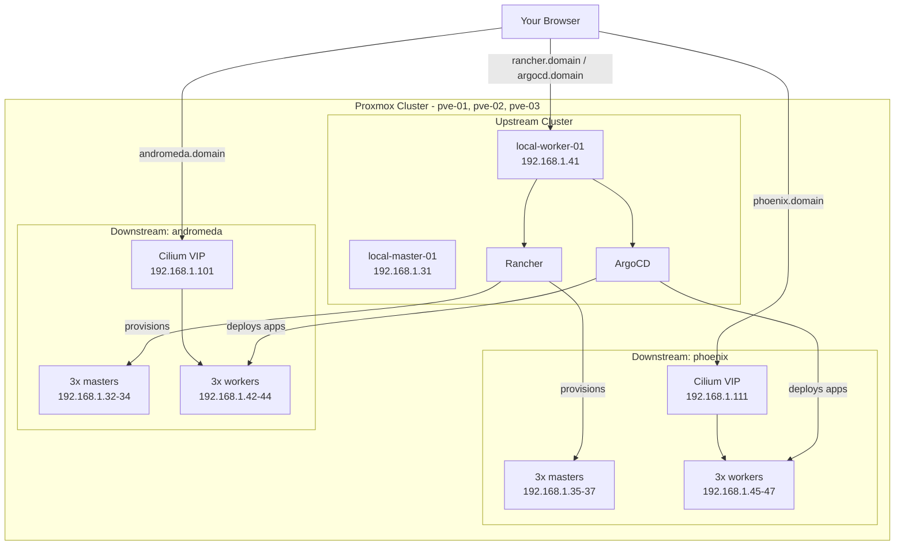
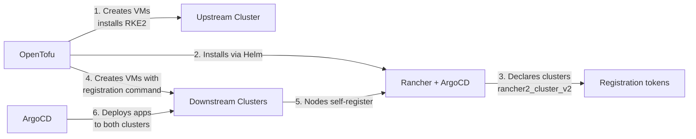

## Purpose

Running a single Kubernetes cluster is one thing. Running several — a production cluster, a staging cluster, each with its own lifecycle — is another problem entirely. That's where **Rancher** comes in: a management platform that provisions and operates multiple Kubernetes clusters from one place.

In this tutorial, we automate the whole thing with OpenTofu on a Proxmox VE cluster. You will deploy:

* An **upstream cluster** (1 control plane, 1 worker) hosting Rancher and ArgoCD
* Two **downstream clusters** named `andromeda` and `phoenix`, each with 3 control planes and 3 workers, provisioned by Rancher
* **Cilium L2 announcements** on each downstream cluster, providing a VIP for the ingress controller
* A **simple web application** deployed to both downstream clusters via ArgoCD ApplicationSets

The Kubernetes flavor is **RKE2**, with **Traefik** as the ingress controller and **Cilium** as the CNI, replacing kube-proxy and using WireGuard encryption.

The full source code is available on my [GitHub repository](https://github.com/richardpct/rancher-on-pve).

## Architecture overview



## Upstream vs downstream

The distinction between upstream and downstream clusters is central to how Rancher works:

* The **upstream cluster** (also called the "local" cluster) is where Rancher itself runs. It's the management plane. In this setup it also hosts ArgoCD.
* The **downstream clusters** are the ones Rancher provisions and manages. Your workloads run here.



This ordering matters and explains why the project has six sequential stacks. Rancher must exist before the downstream clusters can be declared, and the cluster declarations must exist before their nodes can register.

## The node registration flow

This is the most interesting mechanism in the project. When you declare a downstream cluster in Rancher with `rancher2_cluster_v2`, Rancher generates a **registration command** — a shell one-liner that installs the Rancher agent and joins the node to that specific cluster.

OpenTofu extracts that command from the Rancher API and injects it into the cloud-init template of every downstream VM:

```hcl
resource "local_sensitive_file" "downstream_master" {
  for_each = data.terraform_remote_state.rancher.outputs.downstream_clusters

  filename = "/tmp/downstream-master-${each.key}.yaml"
  content  = templatefile("${path.module}/cloud-init/downstream-master.yaml.tftpl",
    {
      ubuntu_mirror    = local.ubuntu_mirror,
      registration_cmd = data.terraform_remote_state.rancher.outputs.downstream_clusters_tokens[each.key]
    }
  )
}
```

Each cluster gets its own cloud-init file (`downstream-master-andromeda.yaml`, `downstream-master-phoenix.yaml`), uploaded to all three Proxmox nodes. When a VM boots, it runs its cluster's registration command and appears in Rancher automatically.

The upstream cluster uses a different mechanism — there's no Rancher yet to hand out tokens. Instead, OpenTofu polls the first master over SSH until RKE2 has written its token to disk, reads it with an `external` data source, and templates it into the worker's cloud-init:

```hcl
resource "null_resource" "wait_rke2_token_is_generated" {
  provisioner "local-exec" {
    command = <<EOF
      while ! ssh ubuntu@${var.k8s_masters[0].ip} 'sudo ls /var/lib/rancher/rke2/server/token'; do
        sleep 2
      done
    EOF
  }
}
```

## Proxmox and VM layout

Three Proxmox nodes host all 14 VMs. Masters and workers are spread across the nodes so losing one physical host doesn't take down a whole cluster's control plane:

| VM | IP | Proxmox node | Cluster |
|---|---|---|---|
| local-master-01 | 192.168.1.31 | pve-01 | upstream |
| local-worker-01 | 192.168.1.41 | pve-02 | upstream |
| andromeda-master-01/02/03 | 192.168.1.32-34 | pve-01/02/03 | andromeda |
| andromeda-worker-01/02/03 | 192.168.1.42-44 | pve-01/02/03 | andromeda |
| phoenix-master-01/02/03 | 192.168.1.35-37 | pve-01/02/03 | phoenix |
| phoenix-worker-01/02/03 | 192.168.1.45-47 | pve-01/02/03 | phoenix |

Each VM gets 2 cores, 4 GB RAM, and a 30 GB disk. Before creating any VM, OpenTofu SSHes into each Proxmox node, checks the SHA256 of the Ubuntu 24.04 cloud image, downloads it if needed, and converts it into a Proxmox template that all VMs are cloned from.

## Cilium L2 announcements and VIPs

Downstream clusters have no cloud load balancer, so a `Service` of type `LoadBalancer` would normally stay stuck in `<pending>`. **Cilium L2 announcements** solve this: Cilium answers ARP requests for a pool of IPs on your LAN, making a service reachable at a fixed address.

Each downstream cluster gets its own VIP range, configured in the ArgoCD ApplicationSet:

```yaml
- list:
    elements:
      - name: andromeda
        start_cilium_vip: "192.168.1.101"
        stop_cilium_vip: "192.168.1.109"
      - name: phoenix
        start_cilium_vip: "192.168.1.111"
        stop_cilium_vip: "192.168.1.119"
```

Traefik's service then requests a specific IP from that pool via a Cilium annotation, set in the cluster's RKE2 chart values:

```yaml
rke2-traefik:
  service:
    spec:
      type: LoadBalancer
    annotations:
      io.cilium/lb-ipam-ips: "192.168.1.101"
```

So `andromeda.yourdomain.com` resolves to `192.168.1.101`, which Cilium announces on the LAN, which routes to Traefik, which routes to your application. The DNS records are created in Route 53 by the `03-dns` stack.

## ArgoCD and multi-cluster GitOps

ArgoCD runs on the upstream cluster but deploys to both downstream clusters. For this to work, ArgoCD needs credentials for each cluster.

OpenTofu generates a Rancher API token and creates one ArgoCD cluster secret per downstream cluster. The trick is that the server URL points at Rancher's proxy endpoint rather than the cluster's API directly:

```hcl
resource "kubernetes_secret_v1" "argocd_cluster_secrets" {
  for_each = rancher2_cluster_v2.downstream_clusters

  metadata {
    name      = "argocd-cluster-${each.value.name}"
    namespace = "argocd"
    labels = {
      "argocd.argoproj.io/secret-type" = "cluster"
      "env"                            = "downstream"
    }
  }

  data = {
    name   = each.value.name
    server = "https://rancher.${var.my_domain}/k8s/clusters/${each.value.cluster_v1_id}"
    config = jsonencode({
      bearerToken     = rancher2_token.argocd.token
      tlsClientConfig = { insecure = false }
    })
  }
}
```

The `env: downstream` label is what makes the ApplicationSets work. The cluster generator selects clusters by that label and merges them with a list of per-cluster values:

```yaml
generators:
  - merge:
      mergeKeys:
        - name
      generators:
        - clusters:
            selector:
              matchLabels:
                env: downstream
        - list:
            elements:
              - name: andromeda
                message: "Welcome to the PRODUCTION cluster: Andromeda"
                replicas: 3
              - name: phoenix
                message: "Welcome to the STAGING cluster: Phoenix"
                replicas: 1
```

One ApplicationSet definition produces two Applications, each with cluster-specific values — three replicas and a production message for andromeda, one replica and a staging message for phoenix. Adding a third cluster means adding one list element, not copying a manifest.

## Project structure

```
rancher-on-pve/
├── modules/
│   ├── bucket/               # S3 bucket for OpenTofu state
│   ├── certificate/          # Let's Encrypt wildcard certificate
│   ├── dns/                  # Route 53 A records
│   ├── upstream/             # Upstream cluster VMs + RKE2
│   │   └── cloud-init/
│   ├── rancher/              # Rancher + ArgoCD via Helm
│   │   ├── rancher.tf
│   │   ├── argocd.tf
│   │   └── helm-values/
│   └── downstream/           # Downstream cluster VMs + registration
│       └── cloud-init/
└── rancher-01/
    ├── 01-bucket/
    ├── 02-certificate/
    ├── 03-dns/
    ├── 04-upstream/
    ├── 05-rancher/
    └── 06-downstream/
```

## Prerequisites

* A Proxmox VE cluster (3 nodes in this example) with root SSH access
* An AWS account with a domain in Route 53 (for DNS and the Let's Encrypt DNS-01 challenge)
* OpenTofu and kubectl installed locally
* A Proxmox API user with permission to create VMs

## Prepare your variables

Create a file at `~/terraform/rancher-on-pve/tofu_vars_secrets`:

```bash
export TF_VAR_region="eu-west-3"
export TF_VAR_bucket="XXXX-rancher-tofu-eu-west-3"
export TF_VAR_key_certificate="tofu/rancher/certificate/tofu.tfstate"
export TF_VAR_key_dns="tofu/rancher/dns/tofu.tfstate"
export TF_VAR_key_upstream="tofu/rancher/upstream/tofu.tfstate"
export TF_VAR_key_rancher="tofu/rancher/rancher/tofu.tfstate"
export TF_VAR_key_downstream="tofu/rancher/downstream/tofu.tfstate"
export TF_VAR_my_domain="yourdomain.com"
export TF_VAR_my_email="you@example.com"
export TF_VAR_pm_user="terraform-prov@pve"
export TF_VAR_pm_password="YOUR_PROXMOX_PASSWORD"
export TF_VAR_nameserver="192.168.1.1"
export TF_VAR_gateway="192.168.1.1"
export TF_VAR_rancher_pass="YOUR_RANCHER_PASSWORD"
export TF_VAR_argocd_pass="YOUR_ARGOCD_PASSWORD"
export TF_VAR_public_ssh_key="ssh-ed25519 AAAA..."
```

Note that `rancher_pass` must be at least 10 characters — the code lowers Rancher's default minimum from 12 to 10, but shorter passwords will still fail.

## Deploy

### 1. S3 bucket for state

    $ cd rancher-01/01-bucket
    $ make apply

### 2. Wildcard TLS certificate

    $ cd ../02-certificate
    $ make apply

Requests `*.yourdomain.com` from Let's Encrypt using a DNS-01 challenge on Route 53. The certificate is reused by Rancher, ArgoCD, and both downstream clusters' Traefik instances.

### 3. DNS records

    $ cd ../03-dns
    $ make apply

Creates four A records: `rancher` and `argocd` pointing at the upstream worker (192.168.1.41), and `andromeda` and `phoenix` pointing at their respective Cilium VIPs.

### 4. Upstream cluster

    $ cd ../04-upstream
    $ make apply

Downloads the Ubuntu cloud image to each Proxmox node, creates the two upstream VMs, installs RKE2 with Cilium, joins the worker, and writes the kubeconfig to `~/.kube/local`.

### 5. Rancher and ArgoCD

    $ cd ../05-rancher
    $ make apply

Installs Rancher via Helm, bootstraps the admin account, declares both downstream clusters (which generates their registration tokens), then installs ArgoCD with the cluster secrets and ApplicationSets.

Wait for the pods to settle:

    $ export KUBECONFIG=~/.kube/local
    $ kubectl get po -A

### 6. Downstream clusters

    $ cd ../06-downstream
    $ make apply

Creates the 12 downstream VMs. Each boots, runs its cluster's registration command, and joins the right cluster. OpenTofu waits until each cluster responds, then installs the wildcard TLS certificate into `kube-system` so Traefik can serve HTTPS. Kubeconfigs land at `~/.kube/andromeda` and `~/.kube/phoenix`.

## Test

Open `https://rancher.yourdomain.com`, go to **Cluster Management**, and wait for both downstream clusters to reach **Active**. This takes several minutes while the nodes register and RKE2 converges.

Check each cluster from the CLI:

    $ export KUBECONFIG=~/.kube/andromeda
    $ kubectl get nodes
    $ export KUBECONFIG=~/.kube/phoenix
    $ kubectl get nodes

Open `https://argocd.yourdomain.com` and log in as `admin`. You should see four applications — `cilium-l2-andromeda`, `cilium-l2-phoenix`, `simple-web-andromeda`, `simple-web-phoenix` — all Healthy and Synced. If any are out of sync, hit Refresh or Sync.

Once everything is green:

    $ curl https://andromeda.yourdomain.com
    $ curl https://phoenix.yourdomain.com

Each returns its own message, and andromeda runs three replicas against phoenix's one — the per-cluster values from the ApplicationSet.

## Clean up

Destroy in reverse order:

    $ cd rancher-01/06-downstream
    $ make destroy
    $ cd ../05-rancher
    $ make destroy
    $ cd ../04-upstream
    $ make destroy
    $ cd ../03-dns
    $ make destroy
    $ cd ../02-certificate
    $ make destroy
    $ cd ../01-bucket
    $ make destroy

## Limitations

Two things to be aware of before adapting this for anything serious:

* **The upstream cluster is not highly available.** It runs a single control plane and a single worker, so losing either takes Rancher and ArgoCD offline. The downstream clusters keep running — they don't depend on Rancher to function — but you lose management and GitOps until it's back. Making it HA means adding masters and putting a VIP in front of the API server.
* **The ArgoCD token has full Rancher permissions.** Fine for a lab, not for production. Scope it to the specific projects and namespaces ArgoCD actually needs.

## Summary

You now have a Rancher management plane provisioning two independent RKE2 clusters, each with its own Cilium VIP and HTTPS ingress, with applications delivered by ArgoCD from a single ApplicationSet definition.

The pattern worth taking away is the layering: OpenTofu builds the upstream cluster imperatively, Rancher declares the downstream clusters, the nodes self-register using tokens Rancher generated, and ArgoCD takes over application delivery from there. Each layer hands off to the next, and adding a third cluster is a matter of a few lines in three files.
